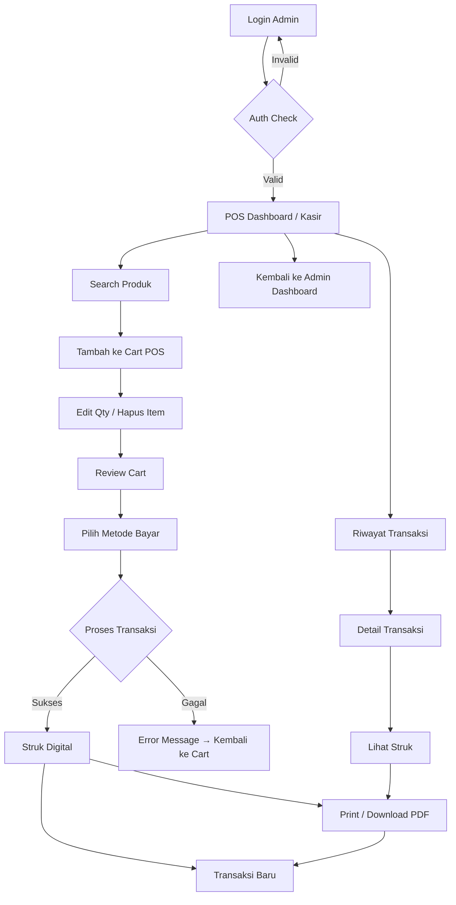
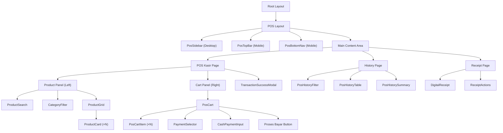

# Implementation Plan — Frontend POS
## Sistem E-Commerce + POS Toko Sembako

> **Scope**: Fokus pengembangan frontend POS (Point of Sale / Kasir)
> **Tech Stack**: Next.js 15 (App Router) · TypeScript 5 · Tailwind CSS v4 · shadcn/ui · Framer Motion v12 · Zustand · Zod + React Hook Form
> **Referensi**: [PRD.md](file:///f:/Coding/POS&ECOMMERCE WEBSITE/PRD.md) · [AI_ENGINEERING_SPEC.md](file:///f:/Coding/POS&ECOMMERCE WEBSITE/AI_ENGINEERING_SPEC.md)

---

## Keputusan Desain (Disetujui ✅)

| # | Keputusan | Status |
|---|-----------|--------|
| 1 | **Color Palette** — Menggunakan palette dari PRD (`#355872 / #7AAACE / #9CD5FF / #F7F8F0`) + warna tambahan untuk success, warning, danger | ✅ Disetujui |
| 2 | **Navigasi** — Desktop: sidebar kiri collapsible (240px → 64px icon-only). Mobile: bottom navigation | ✅ Disetujui |
| 3 | **Keyboard Shortcut** — Ditunda ke fase berikutnya (bukan scope MVP) | ✅ Ditunda |
| 4 | **Bahasa** — Bahasa Indonesia saja untuk MVP | ✅ Disetujui |
| 5 | **Theme** — Light mode saja untuk MVP (tanpa dark mode) | ✅ Disetujui |
| 6 | **Format Struk** — 58mm (thermal printer kecil, lebar ≈ 32 karakter per baris) | ✅ Disetujui |
| 7 | **Sound Feedback** — Tidak diperlukan untuk MVP | ✅ Ditunda |

---

## 1. Design System

### 1.1 Color Palette

Berbasis palette PRD dengan penyesuaian kontras untuk kebutuhan POS:

| Role | Hex | Nama | Penggunaan |
|------|-----|------|------------|
| **Primary** | `#355872` | Deep Ocean | Sidebar, header, elemen utama, tombol primary |
| **Primary Light** | `#7AAACE` | Sky Blue | Hover state, border aktif, elemen sekunder |
| **Primary Lighter** | `#9CD5FF` | Ice Blue | Background highlight, badge, tag kategori |
| **Background** | `#F7F8F0` | Cream White | Background utama halaman |
| **Surface** | `#FFFFFF` | White | Card, modal, panel |
| **Surface Alt** | `#F1F5F9` | Slate 100 | Background alternatif, stripe table |
| **Text Primary** | `#0F172A` | Slate 900 | Teks utama, judul (kontras 4.5:1 ✓) |
| **Text Secondary** | `#475569` | Slate 600 | Teks deskripsi, label |
| **Text Muted** | `#94A3B8` | Slate 400 | Placeholder, hint text |
| **Border** | `#E2E8F0` | Slate 200 | Border card, separator |
| **Success** | `#16A34A` | Green 600 | Transaksi berhasil, stok aman |
| **Warning** | `#D97706` | Amber 600 | Stok hampir habis, peringatan |
| **Danger** | `#DC2626` | Red 600 | Error, hapus item, stok kosong |
| **Info** | `#2563EB` | Blue 600 | Notifikasi, info badge |

### 1.2 Typography

Menggunakan rekomendasi UI Pro Max untuk e-commerce/retail:

| Elemen | Font | Weight | Size |
|--------|------|--------|------|
| **Heading (H1)** | Rubik | 700 (Bold) | 28px / 1.75rem |
| **Heading (H2)** | Rubik | 600 (SemiBold) | 22px / 1.375rem |
| **Heading (H3)** | Rubik | 600 (SemiBold) | 18px / 1.125rem |
| **Body** | Nunito Sans | 400 (Regular) | 15px / 0.938rem |
| **Body Small** | Nunito Sans | 400 (Regular) | 13px / 0.813rem |
| **Label / Caption** | Nunito Sans | 600 (SemiBold) | 12px / 0.75rem |
| **Button** | Rubik | 500 (Medium) | 14px / 0.875rem |
| **POS Total Harga** | Rubik | 700 (Bold) | 36px / 2.25rem |
| **POS Item Price** | Nunito Sans | 600 (SemiBold) | 16px / 1rem |

**Google Fonts Import:**
```css
@import url('https://fonts.googleapis.com/css2?family=Nunito+Sans:wght@300;400;500;600;700&family=Rubik:wght@300;400;500;600;700&display=swap');
```

### 1.3 Spacing System

Menggunakan 4px base unit:

| Token | Value | Penggunaan |
|-------|-------|------------|
| `xs` | 4px | Inner padding ikon |
| `sm` | 8px | Gap antar elemen kecil |
| `md` | 12px | Padding button, input |
| `lg` | 16px | Padding card, gap antar section |
| `xl` | 24px | Margin antar komponen |
| `2xl` | 32px | Padding halaman |
| `3xl` | 48px | Gap antar section besar |

### 1.4 Border Radius

| Token | Value | Penggunaan |
|-------|-------|------------|
| `sm` | 6px | Button kecil, badge |
| `md` | 8px | Input, button normal |
| `lg` | 12px | Card, modal |
| `xl` | 16px | Card besar, panel |
| `full` | 9999px | Avatar, dot indicator |

### 1.5 Shadow System

| Token | Value | Penggunaan |
|-------|-------|------------|
| `sm` | `0 1px 2px rgba(0,0,0,0.05)` | Button, input focus |
| `md` | `0 4px 6px rgba(0,0,0,0.07)` | Card, dropdown |
| `lg` | `0 10px 15px rgba(0,0,0,0.1)` | Modal, popover |
| `xl` | `0 20px 25px rgba(0,0,0,0.1)` | Dialog overlay |

### 1.6 Animation & Transition

| Jenis | Duration | Easing | Penggunaan |
|-------|----------|--------|------------|
| **Hover** | 150ms | ease-in-out | Button, card hover |
| **Expand/Collapse** | 200ms | ease-out | Sidebar, dropdown |
| **Modal** | 250ms | cubic-bezier(0.16,1,0.3,1) | Dialog appear/disappear |
| **Page Transition** | 300ms | ease-in-out | Route change |
| **Cart Item Add** | 300ms | spring(1, 80, 10) | Item masuk ke cart |
| **Success Feedback** | 400ms | ease-out | Checkmark, confetti |

### 1.7 Icon Library

- **Primary**: [Lucide React](https://lucide.dev/) — konsisten, ringan, tree-shakeable
- **Ukuran Standard**: 20px (sidebar), 16px (inline), 24px (action button)
- **Stroke Width**: 1.75 (default Lucide)

---

## 2. Arsitektur Halaman & Navigasi POS

### 2.1 Route Structure

```
src/app/
├── (auth)/
│   └── login/
│       └── page.tsx                 # Halaman login admin
├── (pos)/
│   ├── layout.tsx                   # POS layout (sidebar + main)
│   ├── pos/
│   │   └── page.tsx                 # POS Kasir (halaman utama)
│   ├── pos/history/
│   │   └── page.tsx                 # Riwayat transaksi POS
│   └── pos/receipt/[id]/
│       └── page.tsx                 # Detail struk digital
```

> [!NOTE]
> Route POS dikelompokkan dalam route group `(pos)` agar memiliki layout terpisah dari E-Commerce dan Admin Dashboard. Halaman POS akan menggunakan shared layout dengan sidebar navigasi.

### 2.2 Layout System

#### Desktop Layout (≥1024px)

```
┌──────────────────────────────────────────────────────────────┐
│  SIDEBAR (240px / collapsible → 64px)  │    MAIN CONTENT    │
│                                         │                    │
│  ┌─────────────────────────────────┐   │                    │
│  │  🏪  Logo Toko                  │   │                    │
│  │      "POS Kasir"                │   │                    │
│  └─────────────────────────────────┘   │                    │
│                                         │                    │
│  ── MENU ──────────────────────────    │                    │
│  [📱] Kasir           ← active         │                    │
│  [📋] Riwayat Transaksi               │                    │
│                                         │                    │
│  ── NAVIGASI ──────────────────────    │                    │
│  [← ] Ke Dashboard Admin              │                    │
│  [🚪] Logout                          │                    │
│                                         │                    │
│  ── FOOTER ────────────────────────    │                    │
│  Admin: Nama User                      │                    │
│  Online ●                              │                    │
│                                         │                    │
└──────────────────────────────────────────────────────────────┘
```

#### Mobile Layout (<1024px)

```
┌──────────────────────────────┐
│  TOP BAR                     │
│  [☰]  POS Kasir    [👤]     │
├──────────────────────────────┤
│                              │
│       MAIN CONTENT           │
│                              │
│                              │
│                              │
├──────────────────────────────┤
│  BOTTOM NAV                  │
│  [Kasir]  [Riwayat]  [Menu] │
└──────────────────────────────┘
```

### 2.3 Navigation Flow (Mermaid)



---

## 3. Wireframe & Desain Halaman

### 3.1 Halaman POS Kasir (Halaman Utama)

Ini adalah halaman inti POS — layar yang paling sering digunakan oleh kasir. Dirancang untuk **kecepatan transaksi**.

#### Desktop Layout (Split View)

```
┌─────────────────────────────────────────────────────────────────────────┐
│  SIDEBAR │              LEFT PANEL (60%)         │  RIGHT PANEL (40%)  │
│          │                                        │                     │
│          │  ┌──────────────────────────────────┐  │  ┌───────────────┐ │
│          │  │ 🔍 Cari produk...          [Scan] │  │  │  CART POS     │ │
│          │  └──────────────────────────────────┘  │  │               │ │
│          │                                        │  │  ┌───────────┐│ │
│          │  ── KATEGORI (horizontal scroll) ──   │  │  │ Beras 5kg ││ │
│          │  [Semua] [Beras] [Minyak] [Gula] ...  │  │  │ 2x  65.000││ │
│          │                                        │  │  │    130.000││ │
│          │  ── PRODUK GRID (3-4 kolom) ────────  │  │  └───────────┘│ │
│          │  ┌────────┐ ┌────────┐ ┌────────┐    │  │  ┌───────────┐│ │
│          │  │ 🖼️     │ │ 🖼️     │ │ 🖼️     │    │  │  │ Minyak 2L ││ │
│          │  │Beras   │ │Minyak  │ │Gula    │    │  │  │ 1x  32.000││ │
│          │  │5kg     │ │Goreng  │ │Pasir   │    │  │  │     32.000││ │
│          │  │65.000  │ │2L      │ │1kg     │    │  │  └───────────┘│ │
│          │  │Stok:42 │ │32.000  │ │14.500  │    │  │               │ │
│          │  │  [+]   │ │Stok:28 │ │Stok:55 │    │  │───────────────│ │
│          │  └────────┘ │  [+]   │ │  [+]   │    │  │ Subtotal:     │ │
│          │  ┌────────┐ └────────┘ └────────┘    │  │      162.000  │ │
│          │  │ 🖼️     │ ┌────────┐ ┌────────┐    │  │               │ │
│          │  │Indomie │ │Kecap   │ │Tepung  │    │  │ ══════════════│ │
│          │  │Goreng  │ │Manis   │ │Terigu  │    │  │ TOTAL:        │ │
│          │  │3.500   │ │12.000  │ │1kg     │    │  │   Rp 162.000  │ │
│          │  │Stok:120│ │Stok:35 │ │8.500   │    │  │               │ │
│          │  │  [+]   │ │  [+]   │ │Stok:40 │    │  │ ┌───────────┐│ │
│          │  └────────┘ └────────┘ │  [+]   │    │  │ │💵 Cash    ││ │
│          │                        └────────┘    │  │ │💳 Transfer││ │
│          │                                       │  │ │📱 QRIS    ││ │
│          │                                       │  │ └───────────┘│ │
│          │                                       │  │               │ │
│          │                                       │  │ [  BAYAR  🛒 ]│ │
│          │                                       │  └───────────────┘ │
└─────────────────────────────────────────────────────────────────────────┘
```

#### Mobile Layout (Stacked + Floating Cart Button)

```
┌──────────────────────────────┐
│  [☰]  POS Kasir    [🛒 2]   │
├──────────────────────────────┤
│                              │
│  🔍 Cari produk...          │
│                              │
│  [Semua] [Beras] [Minyak].. │
│                              │
│  ┌────────┐  ┌────────┐     │
│  │ 🖼️     │  │ 🖼️     │     │
│  │Beras   │  │Minyak  │     │
│  │5kg     │  │Goreng  │     │
│  │65.000  │  │2L      │     │
│  │Stok:42 │  │32.000  │     │
│  │  [+]   │  │  [+]   │     │
│  └────────┘  └────────┘     │
│  ┌────────┐  ┌────────┐     │
│  │ ...    │  │ ...    │     │
│  └────────┘  └────────┘     │
│                              │
│         ┌──────────────┐     │
│         │ 🛒 Cart (2)  │     │
│         │ Rp 162.000   │     │
│         │  [CHECKOUT]  │     │
│         └──────────────┘     │
├──────────────────────────────┤
│  [Kasir]  [Riwayat]  [Menu] │
└──────────────────────────────┘
```

### 3.2 Panel Cart POS (Detail)

```
┌─────────────────────────────────┐
│  CART POS                 [🗑️]  │
│  2 item                         │
├─────────────────────────────────┤
│                                 │
│  ┌─────────────────────────┐   │
│  │ Beras Premium 5kg       │   │
│  │ Rp 65.000 /pcs          │   │
│  │ [-]  2  [+]     130.000 │   │
│  │                    [🗑️]  │   │
│  └─────────────────────────┘   │
│                                 │
│  ┌─────────────────────────┐   │
│  │ Minyak Goreng 2L        │   │
│  │ Rp 32.000 /pcs          │   │
│  │ [-]  1  [+]      32.000 │   │
│  │                    [🗑️]  │   │
│  └─────────────────────────┘   │
│                                 │
├─────────────────────────────────┤
│  Subtotal (3 pcs)    Rp162.000 │
│─────────────────────────────────│
│  TOTAL              Rp 162.000 │
├─────────────────────────────────┤
│                                 │
│  Metode Pembayaran:            │
│  ┌─────┐ ┌──────┐ ┌──────┐    │
│  │ 💵  │ │ 💳   │ │ 📱   │    │
│  │Cash │ │Trans │ │QRIS  │    │
│  │ ✓   │ │      │ │      │    │
│  └─────┘ └──────┘ └──────┘    │
│                                 │
│  ┌─────────────────────────┐   │
│  │ Uang diterima:          │   │
│  │ Rp [___200.000________] │   │
│  │ Kembalian: Rp 38.000   │   │
│  └─────────────────────────┘   │
│                                 │
│  ╔═════════════════════════╗   │
│  ║   🛒  PROSES BAYAR      ║   │
│  ╚═════════════════════════╝   │
│                                 │
│  [Bersihkan Cart]              │
│                                 │
└─────────────────────────────────┘
```

### 3.3 Modal Transaksi Berhasil

```
┌─────────────────────────────────┐
│           ✅                    │
│                                 │
│     Transaksi Berhasil!        │
│                                 │
│  Invoice: POS-20260526-001     │
│  Total: Rp 162.000             │
│  Bayar: Rp 200.000             │
│  Kembalian: Rp 38.000          │
│  Metode: Cash                  │
│                                 │
│  ┌───────────────────────────┐ │
│  │   🖨️  Cetak Struk         │ │
│  └───────────────────────────┘ │
│  ┌───────────────────────────┐ │
│  │   📥  Download PDF        │ │
│  └───────────────────────────┘ │
│  ┌───────────────────────────┐ │
│  │   ➕  Transaksi Baru      │ │
│  └───────────────────────────┘ │
│                                 │
└─────────────────────────────────┘
```

### 3.4 Halaman Riwayat Transaksi POS

```
┌────────────────────────────────────────────────────────────┐
│  SIDEBAR │              RIWAYAT TRANSAKSI POS              │
│          │                                                  │
│          │  ┌──────────────────────────────────────────┐   │
│          │  │ 🔍 Cari invoice...   [📅 Tanggal ▾]     │   │
│          │  └──────────────────────────────────────────┘   │
│          │                                                  │
│          │  ┌──────┬───────────────┬─────────┬──────────┐ │
│          │  │ No.  │ Invoice       │ Total   │ Metode   │ │
│          │  ├──────┼───────────────┼─────────┼──────────┤ │
│          │  │  1   │ POS-260526-01 │ 162.000 │ Cash     │ │
│          │  │  2   │ POS-260526-02 │  85.500 │ QRIS     │ │
│          │  │  3   │ POS-260526-03 │ 230.000 │ Transfer │ │
│          │  │  4   │ POS-260526-04 │  45.000 │ Cash     │ │
│          │  │ ...  │ ...           │ ...     │ ...      │ │
│          │  └──────┴───────────────┴─────────┴──────────┘ │
│          │                                                  │
│          │  ── RINGKASAN HARI INI ──────────────────────── │
│          │  Total Transaksi: 12                            │
│          │  Total Pendapatan: Rp 1.450.000                 │
│          │  Cash: 8 | Transfer: 2 | QRIS: 2               │
│          │                                                  │
└────────────────────────────────────────────────────────────┘
```

### 3.5 Halaman Struk Digital (Format 58mm)

Struk dirancang untuk thermal printer 58mm (lebar cetak ≈ 32 karakter/baris). Preview di layar ditampilkan dalam rasio vertikal sempit menyerupai kertas struk.

```
┌──────────────────────────────────────┐
│            STRUK DIGITAL             │
│         (Preview format 58mm)        │
│                                      │
│  ┌──────────────────────────────┐   │
│  │     ================================    │ │
│  │         TOKO SEMBAKO XYZ     │   │
│  │       Jl. Contoh No. 123     │   │
│  │         Telp: 08xxxxxxxxx    │   │
│  │     ================================    │ │
│  │                              │   │
│  │  No  : POS-20260526-001     │   │
│  │  Tgl : 26/05/2026 14:30     │   │
│  │  Kasir: Admin               │   │
│  │  --------------------------------  │   │
│  │  Beras Premium 5kg          │   │
│  │       2 x 65.000   130.000  │   │
│  │  Minyak Goreng 2L           │   │
│  │       1 x 32.000    32.000  │   │
│  │  --------------------------------  │   │
│  │  Subtotal          162.000  │   │
│  │  TOTAL             162.000  │   │
│  │  --------------------------------  │   │
│  │  Bayar (Cash)      200.000  │   │
│  │  Kembalian          38.000  │   │
│  │  --------------------------------  │   │
│  │                              │   │
│  │       Terima Kasih!          │   │
│  │    Barang yg sudah dibeli    │   │
│  │   tidak dapat ditukar/retur  │   │
│  │                              │   │
│  └──────────────────────────────┘   │
│                                      │
│  [Cetak Struk]   [Download PDF]     │
│  [← Kembali ke Riwayat]             │
│                                      │
└──────────────────────────────────────┘
```

---

## 4. Component Architecture

### 4.1 Folder Structure (Feature-based)

```
src/
├── app/
│   ├── (auth)/
│   │   └── login/
│   │       └── page.tsx
│   ├── (pos)/
│   │   ├── layout.tsx                    # POS shell layout
│   │   ├── pos/
│   │   │   ├── page.tsx                  # Halaman kasir utama
│   │   │   ├── history/
│   │   │   │   └── page.tsx              # Riwayat transaksi
│   │   │   └── receipt/[id]/
│   │   │       └── page.tsx              # Struk digital
│   │   └── loading.tsx                   # POS loading skeleton
│   └── layout.tsx                        # Root layout
│
├── components/
│   ├── ui/                               # shadcn/ui components
│   │   ├── button.tsx
│   │   ├── input.tsx
│   │   ├── dialog.tsx
│   │   ├── badge.tsx
│   │   ├── card.tsx
│   │   ├── table.tsx
│   │   ├── select.tsx
│   │   ├── skeleton.tsx
│   │   ├── toast.tsx
│   │   └── ...
│   └── shared/                           # Shared custom components
│       ├── LoadingSkeleton.tsx
│       ├── EmptyState.tsx
│       ├── ErrorBoundary.tsx
│       ├── CurrencyDisplay.tsx           # Format Rupiah
│       └── ConfirmDialog.tsx
│
├── features/
│   └── pos/
│       ├── components/
│       │   ├── PosLayout.tsx             # Sidebar + main area
│       │   ├── PosSidebar.tsx            # Navigasi sidebar
│       │   ├── PosBottomNav.tsx          # Mobile bottom nav
│       │   ├── PosTopBar.tsx             # Mobile top bar
│       │   ├── ProductSearch.tsx         # Search bar + hasil
│       │   ├── CategoryFilter.tsx        # Filter horizontal scroll
│       │   ├── ProductGrid.tsx           # Grid produk
│       │   ├── ProductCard.tsx           # Card produk individual
│       │   ├── PosCart.tsx               # Panel cart keseluruhan
│       │   ├── PosCartItem.tsx           # Item individual di cart
│       │   ├── PaymentSelector.tsx       # Pilih metode bayar
│       │   ├── CashPaymentInput.tsx      # Input uang & hitung kembalian
│       │   ├── TransactionSuccessModal.tsx # Modal sukses
│       │   ├── PosHistoryTable.tsx       # Tabel riwayat
│       │   ├── PosHistoryFilter.tsx      # Filter tanggal & search
│       │   ├── PosHistorySummary.tsx     # Ringkasan harian
│       │   ├── DigitalReceipt.tsx        # Tampilan struk
│       │   └── ReceiptActions.tsx        # Tombol print/download
│       │
│       ├── hooks/
│       │   ├── useProductSearch.ts       # Logika pencarian produk
│       │   ├── usePosTransaction.ts      # Submit transaksi
│       │   ├── usePosHistory.ts          # Fetch riwayat
│       │   └── useReceiptPdf.ts          # Generate PDF
│       │
│       ├── services/
│       │   ├── posTransactionService.ts  # CRUD transaksi POS
│       │   └── posReceiptService.ts      # Generate receipt
│       │
│       ├── types/
│       │   └── pos.types.ts              # TypeScript types POS
│       │
│       └── validations/
│           └── posTransaction.schema.ts  # Zod schema
│
├── stores/
│   └── posCartStore.ts                   # Zustand store POS cart
│
├── lib/
│   ├── supabase/
│   │   ├── client.ts                     # Supabase browser client
│   │   └── server.ts                     # Supabase server client
│   └── utils.ts                          # Utility functions
│
├── hooks/
│   ├── useAuth.ts                        # Auth state hook
│   └── useMediaQuery.ts                  # Responsive hook
│
├── types/
│   └── database.types.ts                 # Supabase generated types
│
└── utils/
    ├── currency.ts                       # Format Rupiah
    ├── invoice.ts                        # Generate invoice number
    └── date.ts                           # Format tanggal Indonesia
```

### 4.2 Component Hierarchy (Tree)



---

## 5. State Management (Zustand)

### 5.1 POS Cart Store

```typescript
// stores/posCartStore.ts
interface PosCartItem {
  productId: string;
  name: string;
  price: number;
  quantity: number;
  stock: number;         // stok tersedia (untuk validasi max qty)
  imageUrl?: string;
}

interface PosCartStore {
  items: PosCartItem[];
  paymentMethod: 'cash' | 'transfer' | 'qris';
  cashReceived: number;

  // Actions
  addItem: (product: Product) => void;
  removeItem: (productId: string) => void;
  updateQuantity: (productId: string, quantity: number) => void;
  incrementQuantity: (productId: string) => void;
  decrementQuantity: (productId: string) => void;
  setPaymentMethod: (method: 'cash' | 'transfer' | 'qris') => void;
  setCashReceived: (amount: number) => void;
  clearCart: () => void;

  // Computed (via get)
  getTotalItems: () => number;
  getTotalPrice: () => number;
  getChange: () => number;            // kembalian = cashReceived - totalPrice
}
```

### 5.2 UI State (minimal)

```typescript
// stores/posUiStore.ts
interface PosUiStore {
  sidebarCollapsed: boolean;
  mobileCartOpen: boolean;         // Sheet/drawer cart di mobile
  successModalOpen: boolean;
  lastTransaction: PosTransaction | null;

  toggleSidebar: () => void;
  setMobileCartOpen: (open: boolean) => void;
  showSuccessModal: (transaction: PosTransaction) => void;
  hideSuccessModal: () => void;
}
```

---

## 6. UX Patterns & Interaksi

### 6.1 Loading States

| Komponen | Loading Pattern |
|----------|-----------------|
| Product Grid | Skeleton card (3×2 grid) dengan pulse animation |
| Cart | Skeleton list items |
| History Table | Skeleton rows (5 baris) |
| Receipt | Skeleton receipt layout |
| Submit Transaction | Button disabled + spinner + "Memproses..." |

### 6.2 Empty States

| Komponen | Empty State |
|----------|-------------|
| Product Grid (no search result) | Ilustrasi + "Produk tidak ditemukan. Coba kata kunci lain." |
| POS Cart (kosong) | Ilustrasi keranjang kosong + "Tambahkan produk untuk memulai transaksi" |
| History (no data) | Ilustrasi + "Belum ada transaksi hari ini" |

### 6.3 Error States

| Situasi | Handling |
|---------|----------|
| Stok habis saat add to cart | Toast warning: "Stok [produk] habis" + disable tombol [+] |
| Qty melebihi stok | Input clamp ke max stok + toast info |
| Transaksi gagal (network) | Toast error + retry button |
| Supabase down | Error boundary + "Koneksi bermasalah, coba lagi" |

### 6.4 Micro-Animations (Framer Motion)

| Interaksi | Animasi |
|-----------|---------|
| Tambah produk ke cart | Card scale bounce (1 → 1.05 → 1) + cart badge pulse |
| Hapus item dari cart | Slide left + fade out |
| Update quantity | Number counter animation (smooth increment) |
| Proses bayar berhasil | Checkmark draw animation + confetti particles |
| Sidebar collapse | Width transition (240px → 64px) smooth |
| Mobile cart sheet | Slide up from bottom |
| Page transition | Fade in (opacity 0 → 1, y: 10 → 0) |

### 6.5 Responsive Behavior

| Breakpoint | Layout | Catatan |
|------------|--------|---------|
| **< 640px** (Mobile) | Single column, bottom nav, floating cart button | Product grid 2 kolom |
| **640-1023px** (Tablet) | Single column, bottom nav, sheet cart | Product grid 3 kolom |
| **≥ 1024px** (Desktop) | Split view (60/40), sidebar | Product grid 3-4 kolom |
| **≥ 1440px** (Large Desktop) | Split view, sidebar expanded | Product grid 4 kolom |

### 6.6 Accessibility (A11y)

| Aspek | Implementasi |
|-------|-------------|
| **Keyboard Navigation** | Tab order: Search → Category → Products → Cart → Payment → Submit |
| **Focus States** | `focus-visible:ring-2 focus-visible:ring-[#7AAACE]` pada semua interactive elements |
| **Screen Reader** | aria-label pada tombol ikon, aria-live pada total cart, role="status" pada toast |
| **Color Contrast** | Text primary (#0F172A) pada bg (#F7F8F0) = rasio 15.2:1 ✓ |
| **Motion** | `prefers-reduced-motion: reduce` — disable animasi, gunakan fade saja |
| **Mobile Input** | `inputMode="numeric"` pada input quantity dan uang diterima |

---

## 7. Komponen Kunci — Spesifikasi Detail

### 7.1 ProductCard

```
┌────────────────────┐
│  ┌──────────────┐  │   Props:
│  │   Product     │  │   - product: Product
│  │   Image       │  │   - onAdd: (product) => void
│  │   (1:1 ratio) │  │   - disabled: boolean
│  └──────────────┘  │
│                    │   States:
│  Beras Premium 5kg │   - normal: bg-white, shadow-sm
│  Rp 65.000         │   - hover: shadow-md, border-[#7AAACE]
│                    │   - stok 0: opacity-50, badge "Habis"
│  Stok: 42          │   - baru ditambah: ring-2 ring-green-400 (flash)
│                    │
│  [ + Tambah ]      │   Behavior:
│                    │   - Klik card → add to cart
└────────────────────┘   - Klik [+] → add to cart
                         - Stok 0 → tombol disabled
```

### 7.2 PosCartItem

```
┌──────────────────────────────────┐
│ ┌──┐                             │   Props:
│ │🖼️│ Beras Premium 5kg          │   - item: PosCartItem
│ └──┘ Rp 65.000 /pcs              │   - onUpdateQty: (id, qty) => void
│                                  │   - onRemove: (id) => void
│      [-]  2  [+]      Rp130.000 │
│                            [🗑️]  │   Validation:
└──────────────────────────────────┘   - min qty: 1
                                       - max qty: item.stock
                                       - decrement di 1 → hapus item
```

### 7.3 PaymentSelector

```
┌─────────────────────────────────┐
│  Metode Pembayaran:             │   Props:
│                                 │   - selected: PaymentMethod
│  ┌───────┐ ┌────────┐ ┌──────┐ │   - onSelect: (method) => void
│  │ Cash  │ │Transfer│ │ QRIS │ │
│  │  ✓    │ │        │ │      │ │   Behavior:
│  └───────┘ └────────┘ └──────┘ │   - Cash: tampilkan CashPaymentInput
│                                 │   - Transfer: tampilkan info rekening
└─────────────────────────────────┘   - QRIS: tampilkan QR code image
```

---

## 8. Proposed Changes

### Folder & File Creation

#### [NEW] Project Setup Files

| File | Deskripsi |
|------|-----------|
| `src/app/layout.tsx` | Root layout dengan font Rubik + Nunito Sans |
| `src/app/globals.css` | Design tokens (CSS variables), Tailwind config |
| `src/lib/supabase/client.ts` | Supabase browser client |
| `src/lib/supabase/server.ts` | Supabase server client |
| `src/lib/utils.ts` | cn() utility (shadcn requirement) |

---

#### [NEW] POS Layout & Navigation

| File | Deskripsi |
|------|-----------|
| `src/app/(pos)/layout.tsx` | POS route group layout |
| `src/features/pos/components/PosLayout.tsx` | Wrapper: sidebar + content |
| `src/features/pos/components/PosSidebar.tsx` | Desktop sidebar navigation |
| `src/features/pos/components/PosTopBar.tsx` | Mobile top bar |
| `src/features/pos/components/PosBottomNav.tsx` | Mobile bottom navigation |

---

#### [NEW] POS Kasir (Main Page)

| File | Deskripsi |
|------|-----------|
| `src/app/(pos)/pos/page.tsx` | Halaman utama kasir |
| `src/features/pos/components/ProductSearch.tsx` | Search bar dengan debounce |
| `src/features/pos/components/CategoryFilter.tsx` | Horizontal scroll kategori |
| `src/features/pos/components/ProductGrid.tsx` | Grid responsive produk |
| `src/features/pos/components/ProductCard.tsx` | Card produk individual |
| `src/features/pos/components/PosCart.tsx` | Panel cart utama |
| `src/features/pos/components/PosCartItem.tsx` | Baris item di cart |
| `src/features/pos/components/PaymentSelector.tsx` | Toggle metode bayar |
| `src/features/pos/components/CashPaymentInput.tsx` | Input cash & kembalian |
| `src/features/pos/components/TransactionSuccessModal.tsx` | Modal sukses |

---

#### [NEW] POS History & Receipt

| File | Deskripsi |
|------|-----------|
| `src/app/(pos)/pos/history/page.tsx` | Halaman riwayat |
| `src/features/pos/components/PosHistoryTable.tsx` | Tabel data transaksi |
| `src/features/pos/components/PosHistoryFilter.tsx` | Filter search + tanggal |
| `src/features/pos/components/PosHistorySummary.tsx` | Ringkasan harian |
| `src/app/(pos)/pos/receipt/[id]/page.tsx` | Halaman struk |
| `src/features/pos/components/DigitalReceipt.tsx` | Layout struk format 58mm (≈32 karakter/baris) |
| `src/features/pos/components/ReceiptActions.tsx` | Tombol print/download |

---

#### [NEW] State Management & Logic

| File | Deskripsi |
|------|-----------|
| `src/stores/posCartStore.ts` | Zustand store cart POS |
| `src/stores/posUiStore.ts` | Zustand store UI state |
| `src/features/pos/hooks/useProductSearch.ts` | Search dengan debounce |
| `src/features/pos/hooks/usePosTransaction.ts` | Submit transaksi |
| `src/features/pos/hooks/usePosHistory.ts` | Fetch & filter history |
| `src/features/pos/hooks/useReceiptPdf.ts` | Generate PDF struk |
| `src/features/pos/services/posTransactionService.ts` | API transaksi |
| `src/features/pos/services/posReceiptService.ts` | Service struk |
| `src/features/pos/types/pos.types.ts` | TypeScript interfaces |
| `src/features/pos/validations/posTransaction.schema.ts` | Zod schemas |

---

#### [NEW] Shared Components & Utilities

| File | Deskripsi |
|------|-----------|
| `src/components/shared/LoadingSkeleton.tsx` | Reusable skeleton |
| `src/components/shared/EmptyState.tsx` | Empty state dengan ilustrasi |
| `src/components/shared/ErrorBoundary.tsx` | Error boundary wrapper |
| `src/components/shared/CurrencyDisplay.tsx` | Format Rupiah |
| `src/components/shared/ConfirmDialog.tsx` | Dialog konfirmasi |
| `src/utils/currency.ts` | `formatRupiah()` utility |
| `src/utils/invoice.ts` | `generateInvoiceNumber()` |
| `src/utils/date.ts` | Format tanggal Indonesia |
| `src/hooks/useMediaQuery.ts` | Responsive breakpoint hook |

---

## 9. Development Priority

### Phase 1 — Foundation & Layout (Estimasi: 2-3 hari)

- [ ] Setup Next.js 15 project + TypeScript + Tailwind CSS v4
- [ ] Install & configure shadcn/ui
- [ ] Setup design tokens (CSS variables, colors, typography)
- [ ] Setup Supabase client
- [ ] Buat POS Layout (sidebar, top bar, bottom nav)
- [ ] Buat navigasi responsive
- [ ] Setup Zustand stores (posCartStore, posUiStore)

### Phase 2 — POS Kasir Core (Estimasi: 3-4 hari)

- [ ] ProductSearch component (dengan debounce)
- [ ] CategoryFilter component (horizontal scroll)
- [ ] ProductGrid + ProductCard components
- [ ] PosCart + PosCartItem components
- [ ] PaymentSelector component
- [ ] CashPaymentInput component
- [ ] Integrasi cart dengan Zustand store
- [ ] Loading skeletons & empty states

### Phase 3 — Transaction Flow (Estimasi: 2-3 hari)

- [ ] posTransactionService (Supabase integration)
- [ ] usePosTransaction hook
- [ ] TransactionSuccessModal component
- [ ] Stock validation (cek stok sebelum submit)
- [ ] Auto-decrement stok setelah transaksi
- [ ] Error handling & toast notifications

### Phase 4 — History & Receipt (Estimasi: 2-3 hari)

- [ ] PosHistoryTable component
- [ ] PosHistoryFilter component (search + date filter)
- [ ] PosHistorySummary component
- [ ] DigitalReceipt component (struk layout format 58mm)
- [ ] ReceiptActions component (print + download)
- [ ] useReceiptPdf hook (PDF generation)

### Phase 5 — Polish & Animation (Estimasi: 1-2 hari)

- [ ] Framer Motion animations (page transitions, cart animations)
- [ ] Micro-interactions (add to cart bounce, success checkmark)
- [ ] Responsive fine-tuning (test 375px → 1440px)
- [ ] Accessibility audit (keyboard nav, focus states, contrast)
- [ ] Performance optimization (lazy load, skeleton, debounce)

---

## 10. Verification Plan

### Automated Tests

```bash
# Linting & Type Check
npx next lint
npx tsc --noEmit

# Build Verification
npm run build
```

### Manual Verification

| Aspek | Cara Verifikasi |
|-------|-----------------|
| **Responsive Layout** | Test di Chrome DevTools: 375px (iPhone SE), 768px (iPad), 1024px, 1440px |
| **POS Flow** | Jalankan flow: search → add → edit qty → pilih bayar → proses → struk |
| **Cart Logic** | Verifikasi: add item, update qty, max stok validation, hapus item, clear cart |
| **Payment** | Test ketiga metode: cash (cek kembalian), transfer, QRIS |
| **History** | Verifikasi: list muncul, filter tanggal berfungsi, search invoice |
| **Receipt** | Verifikasi: data benar, layout struk rapi, PDF download |
| **Loading States** | Throttle network (Slow 3G) → cek skeleton & spinner muncul |
| **Empty States** | Kosongkan data → cek empty state message muncul |
| **Accessibility** | Tab melalui semua elemen → cek focus ring visible |
| **Animation** | Toggle `prefers-reduced-motion` → animasi harus off |

### Browser Testing

| Browser | Priority |
|---------|----------|
| Chrome (Desktop + Mobile) | High |
| Safari (Mobile) | Medium |
| Firefox | Low |

---

## 11. Pre-Delivery Checklist (dari UI Pro Max)

- [ ] Tidak ada emoji sebagai ikon UI (gunakan Lucide React SVG)
- [ ] `cursor-pointer` pada semua elemen klikable
- [ ] Hover states dengan smooth transitions (150-300ms)
- [ ] Light mode: kontras teks minimal 4.5:1
- [ ] Focus states visible untuk keyboard navigation
- [ ] `prefers-reduced-motion` dihormati
- [ ] Responsive di: 375px, 768px, 1024px, 1440px
- [ ] Tidak ada horizontal scroll di mobile
- [ ] Semua gambar memiliki alt text
- [ ] Form inputs memiliki label
- [ ] Warna bukan satu-satunya indikator (selalu ada text/icon)
