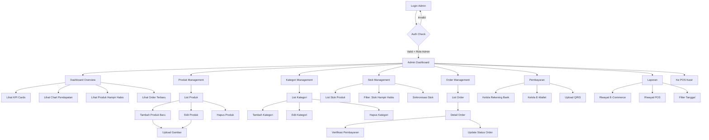

# Implementation Plan — Frontend Admin Dashboard
## Sistem E-Commerce + POS Toko Sembako

> **Scope**: Fokus pengembangan frontend Admin Dashboard
> **Tech Stack**: Next.js 15 (App Router) · TypeScript 5 · Tailwind CSS v4 · shadcn/ui · Framer Motion v12 · Zustand · Zod + React Hook Form · Recharts (via shadcn/ui Chart)
> **Referensi**: [PRD.md](file:///f:/Coding/POS-WEBSITE/PRD.md) · [implementation_plan_frontend_POS.md](file:///f:/Coding/POS-WEBSITE/implementation_plan_frontend_POS.md)

---

## Keputusan Desain (Butuh Persetujuan)

| # | Keputusan | Status |
|---|-----------|--------|
| 1 | **Color Palette** — Menggunakan palette PRD yang sama dengan POS (`#355872 / #7AAACE / #9CD5FF / #F7F8F0`) untuk konsistensi seluruh sistem | ⏳ Menunggu persetujuan |
| 2 | **Typography** — Menggunakan font yang sama dengan POS (Rubik + Nunito Sans) agar konsisten lintas modul | ⏳ Menunggu persetujuan |
| 3 | **Navigasi** — Desktop: sidebar kiri collapsible (260px → 72px icon-only) dengan grouped menu. Mobile: hamburger menu slide-over | ⏳ Menunggu persetujuan |
| 4 | **Chart Library** — Recharts via shadcn/ui `<ChartContainer>` wrapper untuk data visualization | ⏳ Menunggu persetujuan |
| 5 | **Data Table** — TanStack Table + shadcn/ui `<DataTable>` untuk sorting, filtering, pagination | ⏳ Menunggu persetujuan |
| 6 | **Theme** — Light mode saja untuk MVP (konsisten dengan POS) | ⏳ Menunggu persetujuan |
| 7 | **Bahasa** — Bahasa Indonesia saja untuk MVP | ⏳ Menunggu persetujuan |
| 8 | **Breadcrumbs** — Ditampilkan di semua halaman level 2+ untuk navigasi kontekstual | ⏳ Menunggu persetujuan |

---

## 1. Design System

> [!NOTE]
> Design system Admin Dashboard **menggunakan token yang sama** dengan POS untuk menjaga konsistensi visual lintas seluruh platform. Lihat [implementation_plan_frontend_POS.md § 1. Design System](file:///f:/Coding/POS-WEBSITE/implementation_plan_frontend_POS.md) untuk referensi lengkap token warna, typography, spacing, border radius, shadow, dan animasi.

### 1.1 Color Palette (Shared dengan POS)

| Role | Hex | Penggunaan (Dashboard-specific) |
|------|-----|---------------------------------|
| **Primary** | `#355872` | Sidebar background, header, tombol primary |
| **Primary Light** | `#7AAACE` | Menu item active/hover, border aktif |
| **Primary Lighter** | `#9CD5FF` | Badge, highlight KPI card, background subtle |
| **Background** | `#F7F8F0` | Background utama halaman dashboard |
| **Surface** | `#FFFFFF` | Card KPI, panel, modal, form |
| **Surface Alt** | `#F1F5F9` | Background alternatif, stripe table |
| **Text Primary** | `#0F172A` | Heading, data angka, teks utama |
| **Text Secondary** | `#475569` | Label, deskripsi, sub-heading |
| **Text Muted** | `#94A3B8` | Placeholder, hint, timestamp |
| **Border** | `#E2E8F0` | Border card, separator, divider |
| **Success** | `#16A34A` | Pendapatan naik, stok aman, order selesai |
| **Warning** | `#D97706` | Stok hampir habis, order pending |
| **Danger** | `#DC2626` | Stok habis, order ditolak, error |
| **Info** | `#2563EB` | Notifikasi, info badge, link |

### 1.2 Typography (Shared dengan POS)

| Elemen | Font | Weight | Size |
|--------|------|--------|------|
| **Page Title (H1)** | Rubik | 700 (Bold) | 28px / 1.75rem |
| **Section Title (H2)** | Rubik | 600 (SemiBold) | 22px / 1.375rem |
| **Card Title (H3)** | Rubik | 600 (SemiBold) | 18px / 1.125rem |
| **Body** | Nunito Sans | 400 (Regular) | 15px / 0.938rem |
| **Body Small** | Nunito Sans | 400 (Regular) | 13px / 0.813rem |
| **Label / Caption** | Nunito Sans | 600 (SemiBold) | 12px / 0.75rem |
| **Button** | Rubik | 500 (Medium) | 14px / 0.875rem |
| **KPI Big Number** | Rubik | 700 (Bold) | 32px / 2rem |
| **Table Header** | Nunito Sans | 700 (Bold) | 13px / 0.813rem |
| **Table Cell** | Nunito Sans | 400 (Regular) | 14px / 0.875rem |

### 1.3 Dashboard-Specific Tokens

| Token | Value | Penggunaan |
|-------|-------|------------|
| **Sidebar Width (expanded)** | 260px | Sidebar desktop terbuka |
| **Sidebar Width (collapsed)** | 72px | Sidebar desktop icon-only |
| **Header Height** | 64px | Top header mobile |
| **Content Padding** | 24px (desktop), 16px (mobile) | Padding area konten |
| **Card Gap** | 20px | Jarak antar KPI card |
| **Table Row Height** | 52px | Tinggi baris tabel |

### 1.4 Icon Library

- **Primary**: [Lucide React](https://lucide.dev/) — konsisten dengan POS
- **Dashboard Icons**: `LayoutDashboard`, `Package`, `FolderTree`, `ShoppingCart`, `CreditCard`, `BarChart3`, `Warehouse`, `Settings`, `ChevronLeft`, `ChevronRight`, `Bell`, `LogOut`, `User`, `Search`, `Filter`, `Plus`, `Pencil`, `Trash2`, `Eye`, `Download`, `Upload`, `RefreshCw`
- **Ukuran**: 20px (sidebar menu), 16px (inline/table), 24px (header action)

---

## 2. Arsitektur Navigasi Admin Dashboard

### 2.1 Sidebar Navigation Structure

Sidebar dibagi menjadi **menu groups** untuk organisasi yang jelas:

```
┌─────────────────────────────────────┐
│                                     │
│  ┌───────────────────────────────┐  │
│  │  🏪  Toko Sembako             │  │
│  │      Admin Panel              │  │
│  └───────────────────────────────┘  │
│                                     │
│  ── UTAMA ─────────────────────    │
│  [LayoutDashboard]  Dashboard      │  ← Overview statistik
│                                     │
│  ── KELOLA TOKO ───────────────    │
│  [Package]          Produk         │  ← CRUD produk + gambar
│  [FolderTree]       Kategori       │  ← CRUD kategori
│  [Warehouse]        Stok           │  ← Monitoring & sinkronisasi
│                                     │
│  ── TRANSAKSI ─────────────────    │
│  [ShoppingCart]     Pesanan        │  ← Order masuk + verifikasi
│  [CreditCard]       Pembayaran     │  ← Kelola rekening/QRIS
│  [BarChart3]        Laporan        │  ← Riwayat transaksi
│                                     │
│  ── NAVIGASI ──────────────────    │
│  [Monitor]          Ke POS Kasir   │  ← Link ke /pos
│                                     │
│  ── FOOTER ────────────────────    │
│  ┌───────────────────────────────┐  │
│  │ 👤 Admin User                 │  │
│  │ admin@toko.com                │  │
│  │ [LogOut]                      │  │
│  └───────────────────────────────┘  │
│                                     │
└─────────────────────────────────────┘
```

### 2.2 Navigation Items Detail

| Group | Menu Item | Icon (Lucide) | Route | Badge/Indicator |
|-------|-----------|---------------|-------|-----------------|
| **Utama** | Dashboard | `LayoutDashboard` | `/admin` | — |
| **Kelola Toko** | Produk | `Package` | `/admin/products` | — |
| | Kategori | `FolderTree` | `/admin/categories` | — |
| | Stok | `Warehouse` | `/admin/stock` | 🔴 badge count (stok hampir habis) |
| **Transaksi** | Pesanan | `ShoppingCart` | `/admin/orders` | 🔴 badge count (order pending) |
| | Pembayaran | `CreditCard` | `/admin/payments` | — |
| | Laporan | `BarChart3` | `/admin/reports` | — |
| **Navigasi** | Ke POS Kasir | `Monitor` | `/pos` | — |

### 2.3 Route Structure

```
src/app/
├── (auth)/
│   └── login/
│       └── page.tsx                     # Halaman login admin (shared)
├── (admin)/
│   ├── layout.tsx                       # Admin layout (sidebar + header + main)
│   ├── admin/
│   │   ├── page.tsx                     # Dashboard Overview
│   │   ├── products/
│   │   │   ├── page.tsx                 # List produk
│   │   │   ├── create/
│   │   │   │   └── page.tsx             # Tambah produk baru
│   │   │   └── [id]/
│   │   │       └── edit/
│   │   │           └── page.tsx         # Edit produk
│   │   ├── categories/
│   │   │   └── page.tsx                 # Kelola kategori (inline CRUD)
│   │   ├── stock/
│   │   │   └── page.tsx                 # Monitoring stok
│   │   ├── orders/
│   │   │   ├── page.tsx                 # List order masuk
│   │   │   └── [id]/
│   │   │       └── page.tsx             # Detail order + verifikasi
│   │   ├── payments/
│   │   │   └── page.tsx                 # Kelola metode pembayaran
│   │   └── reports/
│   │       └── page.tsx                 # Laporan transaksi
│   └── loading.tsx                      # Admin loading skeleton
├── (pos)/
│   └── ...                              # POS routes (existing)
└── layout.tsx                           # Root layout
```

> [!NOTE]
> Route Admin dikelompokkan dalam route group `(admin)` agar memiliki layout terpisah dari POS dan E-Commerce. Admin dashboard menggunakan layout sendiri dengan sidebar navigasi yang lebih kompleks dibanding POS.

### 2.4 Navigation Flow (Mermaid)



### 2.5 Layout System

#### Desktop Layout (≥1024px)

```
┌──────────────────────────────────────────────────────────────────────────┐
│  SIDEBAR (260px / collapsible → 72px)  │         TOP HEADER             │
│                                         │  [Collapse ☰]  Breadcrumb     │
│  ┌───────────────────────────────┐     │            [🔔] [👤 Admin ▾]  │
│  │  🏪  Toko Sembako             │     ├────────────────────────────────│
│  │      Admin Panel              │     │                                │
│  └───────────────────────────────┘     │         MAIN CONTENT           │
│                                         │                                │
│  ── UTAMA ─────────────────────       │   ┌──────────┐ ┌──────────┐    │
│  [▣] Dashboard          ← active      │   │ KPI Card │ │ KPI Card │    │
│                                         │   │ Total    │ │ Total    │    │
│  ── KELOLA TOKO ───────────────       │   │ Transaksi│ │ Order    │    │
│  [▢] Produk                            │   └──────────┘ └──────────┘    │
│  [▢] Kategori                          │   ┌──────────┐ ┌──────────┐    │
│  [▢] Stok                 [3]          │   │ KPI Card │ │ KPI Card │    │
│                                         │   │ Pendapa- │ │ Produk   │    │
│  ── TRANSAKSI ─────────────────       │   │ tan      │ │ Habis    │    │
│  [▢] Pesanan              [5]          │   └──────────┘ └──────────┘    │
│  [▢] Pembayaran                        │                                │
│  [▢] Laporan                           │   ┌────────────────────────┐   │
│                                         │   │    Chart Pendapatan    │   │
│  ── NAVIGASI ──────────────────       │   │    (Area/Bar Chart)    │   │
│  [→] Ke POS Kasir                      │   └────────────────────────┘   │
│                                         │                                │
│  ┌───────────────────────────────┐     │   ┌────────────────────────┐   │
│  │ 👤 Admin User                 │     │   │   Order Terbaru        │   │
│  │ [Logout]                      │     │   │   (Table kompak)       │   │
│  └───────────────────────────────┘     │   └────────────────────────┘   │
│                                         │                                │
└──────────────────────────────────────────────────────────────────────────┘
```

#### Sidebar Collapsed State (72px)

```
┌──────┐
│  🏪  │   ← Logo saja (tanpa teks)
├──────┤
│  [▣] │   ← Icon only + tooltip on hover
│  [▢] │
│  [▢] │
│  [▢] │
│  ·3· │   ← Badge tetap terlihat
│ ──── │
│  [▢] │
│  ·5· │
│  [▢] │
│  [▢] │
│ ──── │
│  [→] │
│      │
│  👤  │
│  [↗] │
└──────┘
```

#### Tablet Layout (768px - 1023px)

```
┌────────────────────────────────────────────┐
│  [☰]  Admin Dashboard    [🔔] [👤 Admin]  │
├────────────────────────────────────────────┤
│  Breadcrumb: Dashboard > ...               │
├────────────────────────────────────────────┤
│                                            │
│         MAIN CONTENT                       │
│         (Full width, sidebar hidden)       │
│                                            │
│  ┌──────────┐  ┌──────────┐               │
│  │ KPI Card │  │ KPI Card │               │
│  └──────────┘  └──────────┘               │
│  ┌──────────┐  ┌──────────┐               │
│  │ KPI Card │  │ KPI Card │               │
│  └──────────┘  └──────────┘               │
│                                            │
│  ┌────────────────────────────────────┐   │
│  │           Chart Section            │   │
│  └────────────────────────────────────┘   │
│                                            │
└────────────────────────────────────────────┘

 Hamburger [☰] → Slide-over sidebar (overlay)
```

#### Mobile Layout (<768px)

```
┌──────────────────────────────┐
│  [☰]  Admin        [🔔][👤] │
├──────────────────────────────┤
│  Dashboard > ...             │
├──────────────────────────────┤
│                              │
│  ┌──────────────────────┐   │
│  │ KPI: Transaksi Hari  │   │
│  │ Ini = 24             │   │
│  └──────────────────────┘   │
│  ┌──────────────────────┐   │
│  │ KPI: Total Order     │   │
│  │ = 12                 │   │
│  └──────────────────────┘   │
│  ┌──────────────────────┐   │
│  │ KPI: Pendapatan      │   │
│  │ = Rp 2.450.000       │   │
│  └──────────────────────┘   │
│  ┌──────────────────────┐   │
│  │ KPI: Stok Hampir     │   │
│  │ Habis = 5 produk     │   │
│  └──────────────────────┘   │
│                              │
│  ┌──────────────────────┐   │
│  │   Chart (scrollable) │   │
│  └──────────────────────┘   │
│                              │
└──────────────────────────────┘

Hamburger [☰] → Full-screen slide-over sidebar
```

### 2.6 Sidebar Behavior

| Aspek | Desktop (≥1024px) | Tablet (768-1023px) | Mobile (<768px) |
|-------|-------------------|---------------------|-----------------|
| **Default State** | Expanded (260px) | Hidden | Hidden |
| **Toggle** | Collapse button (→ 72px icon-only) | Hamburger → overlay slide-over | Hamburger → overlay slide-over |
| **Overlay** | Tidak | Ya (backdrop blur) | Ya (backdrop blur) |
| **Close** | Collapse button | Klik backdrop / close button | Klik backdrop / close button |
| **Active Indicator** | Left border 3px `#7AAACE` + bg tint | Same | Same |
| **Hover** | Background `#7AAACE/10` + text color shift | Same | Same |
| **Badge** | Text badge `(3)` samping label | Icon badge (dot) | Text badge di samping |
| **Transition** | Width: 200ms ease-out | Slide-in: 250ms cubic-bezier | Slide-in: 250ms cubic-bezier |

### 2.7 Top Header Bar

```
┌──────────────────────────────────────────────────────────────┐
│  [☰ Collapse]   Dashboard > Produk > Edit          [🔔 3] [👤 Admin ▾]  │
│                  ↑ Breadcrumb                        ↑ Notif  ↑ User Menu │
└──────────────────────────────────────────────────────────────┘
```

| Elemen | Deskripsi |
|--------|-----------|
| **Collapse Button** | Desktop: toggle sidebar width. Tablet/Mobile: open sidebar overlay |
| **Breadcrumb** | Path navigasi dinamis berdasarkan route (Home > Section > Page) |
| **Notification Bell** | Badge count untuk order pending + stok rendah. Klik → dropdown notifikasi |
| **User Menu** | Dropdown: Nama, Email, Logout |

---

## 3. Wireframe & Desain Halaman

### 3.1 Halaman Dashboard Overview (`/admin`)

Halaman utama yang memberikan ringkasan operasional toko secara sekilas.

#### Desktop Layout

```
┌───────────────────────────────────────────────────────────────────────────┐
│ SIDEBAR │                    DASHBOARD OVERVIEW                          │
│         │                                                                 │
│         │  ── KPI CARDS (4 kolom grid) ─────────────────────────────── │
│         │  ┌─────────────┐ ┌─────────────┐ ┌─────────────┐ ┌──────────┐│
│         │  │ 📊 Total    │ │ 📦 Total    │ │ 💰 Total    │ │ ⚠️ Produk ││
│         │  │ Transaksi   │ │ Order       │ │ Pendapatan  │ │ Hampir   ││
│         │  │ Hari Ini    │ │ Hari Ini    │ │ Hari Ini    │ │ Habis    ││
│         │  │             │ │             │ │             │ │          ││
│         │  │   24        │ │   12        │ │ Rp2.450.000 │ │   5      ││
│         │  │ ↑ 12% vs    │ │ ↑ 8% vs    │ │ ↑ 15% vs   │ │ ⚠ Alert  ││
│         │  │ kemarin     │ │ kemarin     │ │ kemarin     │ │          ││
│         │  └─────────────┘ └─────────────┘ └─────────────┘ └──────────┘│
│         │                                                                 │
│         │  ── CHART SECTION (2 kolom) ──────────────────────────────── │
│         │  ┌──────────────────────────┐  ┌──────────────────────────┐  │
│         │  │ 📈 Pendapatan 7 Hari     │  │ 📊 Transaksi per Metode  │  │
│         │  │    Terakhir              │  │    Pembayaran            │  │
│         │  │                          │  │                          │  │
│         │  │  ┌─────────────────┐    │  │    ┌──────────────┐     │  │
│         │  │  │   Area Chart    │    │  │    │  Donut Chart │     │  │
│         │  │  │   (Recharts)    │    │  │    │              │     │  │
│         │  │  │    ╱──╲         │    │  │    │   Cash: 60%  │     │  │
│         │  │  │   ╱    ╲──╱╲   │    │  │    │   QRIS: 25%  │     │  │
│         │  │  │  ╱          ╲  │    │  │    │   Trans: 15% │     │  │
│         │  │  └─────────────────┘    │  │    └──────────────┘     │  │
│         │  │                          │  │                          │  │
│         │  └──────────────────────────┘  └──────────────────────────┘  │
│         │                                                                 │
│         │  ── TABLES (2 kolom) ─────────────────────────────────────── │
│         │  ┌──────────────────────────┐  ┌──────────────────────────┐  │
│         │  │ 🛒 Order Terbaru         │  │ ⚠️ Produk Stok Rendah    │  │
│         │  │                          │  │                          │  │
│         │  │ INV-001 │Pending│162.000 │  │ Beras 5kg    │ Stok: 3  │  │
│         │  │ INV-002 │Proses │ 85.500 │  │ Minyak 2L    │ Stok: 5  │  │
│         │  │ INV-003 │Verif  │230.000 │  │ Gula 1kg     │ Stok: 2  │  │
│         │  │ INV-004 │Selesai│ 45.000 │  │ Tepung 1kg   │ Stok: 4  │  │
│         │  │ INV-005 │Pending│120.000 │  │ Kecap 500ml  │ Stok: 1  │  │
│         │  │                          │  │                          │  │
│         │  │ [Lihat Semua →]          │  │ [Lihat Semua →]          │  │
│         │  └──────────────────────────┘  └──────────────────────────┘  │
│         │                                                                 │
└───────────────────────────────────────────────────────────────────────────┘
```

#### KPI Card Detail

```
┌─────────────────────────────┐
│  [Icon]                      │    Props:
│                              │    - title: string
│  Total Transaksi Hari Ini   │    - value: string | number
│                              │    - trend: { value: number, direction: 'up'|'down' }
│     24                       │    - icon: LucideIcon
│                              │    - accentColor: string
│  ↑ 12% vs kemarin           │
│  (hijau jika naik, merah    │    States:
│   jika turun)               │    - loading: skeleton pulse
│                              │    - error: dash "-"
└─────────────────────────────┘
```

### 3.2 Halaman Produk Management (`/admin/products`)

#### Desktop Layout — List View

```
┌───────────────────────────────────────────────────────────────────────────┐
│ SIDEBAR │                    PRODUK MANAGEMENT                           │
│         │                                                                 │
│         │  Kelola Produk                                                 │
│         │  Tambah, edit, dan hapus produk toko Anda.                     │
│         │                                                                 │
│         │  ┌────────────────────────────────────────────────────────┐    │
│         │  │ 🔍 Cari produk...        [Kategori ▾] [+ Tambah Produk] │    │
│         │  └────────────────────────────────────────────────────────┘    │
│         │                                                                 │
│         │  ┌────────────────────────────────────────────────────────┐    │
│         │  │ ☐ │ Gambar │ Nama Produk  │ Kategori│Harga  │Stok│Aksi│    │
│         │  ├───┼────────┼──────────────┼─────────┼───────┼────┼────┤    │
│         │  │ ☐ │ [🖼️]   │ Beras 5kg   │ Beras   │65.000 │ 42 │✏️🗑️│    │
│         │  │ ☐ │ [🖼️]   │ Minyak 2L   │ Minyak  │32.000 │ 28 │✏️🗑️│    │
│         │  │ ☐ │ [🖼️]   │ Gula 1kg    │ Gula    │14.500 │  5 │✏️🗑️│    │
│         │  │ ☐ │ [🖼️]   │ Indomie     │ Mie     │ 3.500 │120 │✏️🗑️│    │
│         │  │ ☐ │ [🖼️]   │ Kecap Manis │ Bumbu   │12.000 │ 35 │✏️🗑️│    │
│         │  └────────────────────────────────────────────────────────┘    │
│         │                                                                 │
│         │  ← 1  2  3  ...  10 →        Menampilkan 1-10 dari 85         │
│         │                                                                 │
└───────────────────────────────────────────────────────────────────────────┘
```

#### Halaman Tambah / Edit Produk (`/admin/products/create` & `/admin/products/[id]/edit`)

```
┌───────────────────────────────────────────────────────────────────────────┐
│ SIDEBAR │              TAMBAH PRODUK BARU                                │
│         │  Dashboard > Produk > Tambah Baru                              │
│         │                                                                 │
│         │  ┌───────────────────────────────────────────────────────┐     │
│         │  │                 FORM PRODUK                           │     │
│         │  │                                                       │     │
│         │  │  ── INFORMASI PRODUK ──────────────────────────────  │     │
│         │  │                                                       │     │
│         │  │  Nama Produk *                                        │     │
│         │  │  ┌─────────────────────────────────────────────┐     │     │
│         │  │  │ Masukkan nama produk...                      │     │     │
│         │  │  └─────────────────────────────────────────────┘     │     │
│         │  │                                                       │     │
│         │  │  Kategori *                        Harga (Rp) *      │     │
│         │  │  ┌──────────────────────┐  ┌──────────────────────┐ │     │
│         │  │  │ Pilih kategori... ▾  │  │ 0                    │ │     │
│         │  │  └──────────────────────┘  └──────────────────────┘ │     │
│         │  │                                                       │     │
│         │  │  Stok *                            Status             │     │
│         │  │  ┌──────────────────────┐  ┌──────────────────────┐ │     │
│         │  │  │ 0                    │  │ ● Aktif  ○ Nonaktif  │ │     │
│         │  │  └──────────────────────┘  └──────────────────────┘ │     │
│         │  │                                                       │     │
│         │  │  Deskripsi                                           │     │
│         │  │  ┌─────────────────────────────────────────────┐     │     │
│         │  │  │ Masukkan deskripsi produk...                 │     │     │
│         │  │  │                                              │     │     │
│         │  │  │                                              │     │     │
│         │  │  └─────────────────────────────────────────────┘     │     │
│         │  │                                                       │     │
│         │  │  ── GAMBAR PRODUK ─────────────────────────────────  │     │
│         │  │                                                       │     │
│         │  │  ┌─────────────────────────────────────────────┐     │     │
│         │  │  │                                              │     │     │
│         │  │  │     📷 Drag & drop gambar di sini            │     │     │
│         │  │  │     atau klik untuk upload                   │     │     │
│         │  │  │                                              │     │     │
│         │  │  │     Format: JPG, PNG (Max 2MB)               │     │     │
│         │  │  │                                              │     │     │
│         │  │  └─────────────────────────────────────────────┘     │     │
│         │  │                                                       │     │
│         │  │  ┌───────────┐  ┌────────────────────────┐          │     │
│         │  │  │  Batal    │  │  ✓ Simpan Produk       │          │     │
│         │  │  └───────────┘  └────────────────────────┘          │     │
│         │  │                                                       │     │
│         │  └───────────────────────────────────────────────────────┘     │
│         │                                                                 │
└───────────────────────────────────────────────────────────────────────────┘
```

### 3.3 Halaman Kategori Management (`/admin/categories`)

Kategori menggunakan **inline editing** (tanpa halaman create/edit terpisah) karena data kategori sederhana (hanya `name`).

```
┌───────────────────────────────────────────────────────────────────────────┐
│ SIDEBAR │              KATEGORI MANAGEMENT                               │
│         │                                                                 │
│         │  Kelola Kategori                                               │
│         │  Atur kategori produk toko Anda.                               │
│         │                                                                 │
│         │  ┌──────────────────────────────────────────────────┐          │
│         │  │ ┌─────────────────────────┐  [+ Tambah Kategori] │          │
│         │  │ │ 🔍 Cari kategori...      │                      │          │
│         │  │ └─────────────────────────┘                      │          │
│         │  │                                                   │          │
│         │  │ ┌──────────────────────────────────────────────┐ │          │
│         │  │ │  No  │ Nama Kategori  │ Jumlah Produk │ Aksi │ │          │
│         │  │ ├──────┼────────────────┼───────────────┼──────┤ │          │
│         │  │ │  1   │ Beras          │ 8 produk      │ ✏️ 🗑️ │ │          │
│         │  │ │  2   │ Minyak Goreng  │ 5 produk      │ ✏️ 🗑️ │ │          │
│         │  │ │  3   │ Gula           │ 4 produk      │ ✏️ 🗑️ │ │          │
│         │  │ │  4   │ Bumbu Dapur    │ 12 produk     │ ✏️ 🗑️ │ │          │
│         │  │ │  5   │ Mie Instan     │ 6 produk      │ ✏️ 🗑️ │ │          │
│         │  │ └──────────────────────────────────────────────┘ │          │
│         │  └──────────────────────────────────────────────────┘          │
│         │                                                                 │
│         │  ── INLINE EDIT MODE ──                                        │
│         │  (Saat klik ✏️, baris berubah menjadi input inline)            │
│         │  ┌──────┬─────────────────────────┬──────┬────────┐           │
│         │  │  2   │ [Minyak Goreng____]     │  5   │ ✓  ✕  │           │
│         │  └──────┴─────────────────────────┴──────┴────────┘           │
│         │                                                                 │
│         │  ── TAMBAH KATEGORI (Dialog) ──                                │
│         │  ┌─────────────────────────────┐                               │
│         │  │ Tambah Kategori Baru        │                               │
│         │  │                             │                               │
│         │  │ Nama Kategori *             │                               │
│         │  │ ┌─────────────────────┐    │                               │
│         │  │ │                     │    │                               │
│         │  │ └─────────────────────┘    │                               │
│         │  │                             │                               │
│         │  │ [Batal]    [✓ Simpan]      │                               │
│         │  └─────────────────────────────┘                               │
│         │                                                                 │
└───────────────────────────────────────────────────────────────────────────┘
```

### 3.4 Halaman Stok Management (`/admin/stock`)

```
┌───────────────────────────────────────────────────────────────────────────┐
│ SIDEBAR │              MONITORING STOK                                   │
│         │                                                                 │
│         │  Monitoring Stok                                               │
│         │  Pantau ketersediaan stok produk secara realtime.              │
│         │                                                                 │
│         │  ── SUMMARY CARDS (3 kolom) ───────────────────────────────── │
│         │  ┌─────────────────┐ ┌─────────────────┐ ┌─────────────────┐  │
│         │  │ ✅ Stok Aman     │ │ ⚠️ Hampir Habis  │ │ 🔴 Stok Habis   │  │
│         │  │                  │ │                  │ │                  │  │
│         │  │   72 produk      │ │   5 produk       │ │   2 produk       │  │
│         │  └─────────────────┘ └─────────────────┘ └─────────────────┘  │
│         │                                                                 │
│         │  ┌────────────────────────────────────────────────────────┐    │
│         │  │ 🔍 Cari produk...   [Status ▾] [Kategori ▾] [↻ Sync]  │    │
│         │  └────────────────────────────────────────────────────────┘    │
│         │                                                                 │
│         │  ┌────────────────────────────────────────────────────────┐    │
│         │  │  Produk         │ Kategori │ Stok │ Status    │ Terakhir│   │
│         │  ├─────────────────┼──────────┼──────┼───────────┼─────────┤   │
│         │  │  Gula 1kg       │ Gula     │  2   │ 🔴 Habis  │ 2 jam   │   │
│         │  │  Kecap 500ml    │ Bumbu    │  1   │ 🔴 Habis  │ 1 jam   │   │
│         │  │  Beras 5kg      │ Beras    │  3   │ ⚠️ Rendah │ 30 min  │   │
│         │  │  Minyak 2L      │ Minyak   │  5   │ ⚠️ Rendah │ 1 jam   │   │
│         │  │  Tepung 1kg     │ Tepung   │  4   │ ⚠️ Rendah │ 45 min  │   │
│         │  │  Indomie Goreng │ Mie      │ 120  │ ✅ Aman   │ 2 jam   │   │
│         │  │  Sabun Cuci     │ Kebersih │  80  │ ✅ Aman   │ 3 jam   │   │
│         │  └────────────────────────────────────────────────────────┘    │
│         │                                                                 │
│         │  ← 1  2  3 →                                                  │
│         │                                                                 │
└───────────────────────────────────────────────────────────────────────────┘
```

> [!IMPORTANT]
> **Stok threshold (MVP):** Stok ≤ 5 = ⚠️ Hampir Habis (Warning), Stok = 0 = 🔴 Habis (Danger). Threshold ini di-hardcode untuk MVP, ke depan bisa dikonfigurasi per produk.

### 3.5 Halaman Order Management (`/admin/orders`)

#### List View

```
┌───────────────────────────────────────────────────────────────────────────┐
│ SIDEBAR │              PESANAN MASUK                                     │
│         │                                                                 │
│         │  Kelola Pesanan                                                │
│         │  Verifikasi pembayaran dan update status order.                │
│         │                                                                 │
│         │  ── STATUS TABS ──────────────────────────────────────────── │
│         │  [Semua (24)] [Pending (5)] [Verifikasi (3)] [Proses (8)]     │
│         │  [Dikirim (6)] [Selesai (2)] [Ditolak (0)]                    │
│         │                                                                 │
│         │  ┌────────────────────────────────────────────────────────┐    │
│         │  │ 🔍 Cari invoice/nama...                [📅 Tanggal ▾] │    │
│         │  └────────────────────────────────────────────────────────┘    │
│         │                                                                 │
│         │  ┌────────────────────────────────────────────────────────┐    │
│         │  │ Invoice     │ Customer    │ Total   │Status  │Tanggal │    │
│         │  ├─────────────┼─────────────┼─────────┼────────┼────────┤    │
│         │  │ INV-260526  │ Budi        │ 162.000 │⏳Pending│ 26 Mei │    │
│         │  │ INV-260527  │ Sari        │  85.500 │🔍Verif │ 26 Mei │    │
│         │  │ INV-260528  │ Ahmad       │ 230.000 │📦Proses│ 26 Mei │    │
│         │  │ INV-260529  │ Dewi        │  45.000 │🚚Kirim │ 25 Mei │    │
│         │  │ INV-260530  │ Rina        │ 120.000 │✅Selesai│ 25 Mei │    │
│         │  └────────────────────────────────────────────────────────┘    │
│         │                                                                 │
│         │  ← 1  2  3 →                                                  │
│         │                                                                 │
└───────────────────────────────────────────────────────────────────────────┘
```

#### Detail Order (`/admin/orders/[id]`)

```
┌───────────────────────────────────────────────────────────────────────────┐
│ SIDEBAR │              DETAIL ORDER #INV-260526-001                      │
│         │  Dashboard > Pesanan > Detail                                  │
│         │                                                                 │
│         │  ── INFORMASI ORDER ─── (2 kolom) ────────────────────────── │
│         │  ┌──────────────────────────┐  ┌──────────────────────────┐  │
│         │  │ 📋 Info Order            │  │ 👤 Info Customer         │  │
│         │  │                          │  │                          │  │
│         │  │ Invoice: INV-260526-001  │  │ Nama: Budi Santoso      │  │
│         │  │ Tanggal: 26 Mei 2026    │  │ WhatsApp: 08123456789   │  │
│         │  │ Status : ⏳ Pending      │  │ Alamat: Jl. Contoh 123 │  │
│         │  │ Metode : Transfer Bank   │  │ Catatan: -              │  │
│         │  └──────────────────────────┘  └──────────────────────────┘  │
│         │                                                                 │
│         │  ── ITEM ORDER ──────────────────────────────────────────── │
│         │  ┌────────────────────────────────────────────────────────┐    │
│         │  │  Produk          │ Harga   │ Qty │ Subtotal           │    │
│         │  ├──────────────────┼─────────┼─────┼────────────────────┤    │
│         │  │  Beras 5kg       │ 65.000  │  2  │ 130.000            │    │
│         │  │  Minyak Goreng   │ 32.000  │  1  │  32.000            │    │
│         │  ├──────────────────┼─────────┼─────┼────────────────────┤    │
│         │  │                  │         │Total│ Rp 162.000         │    │
│         │  └────────────────────────────────────────────────────────┘    │
│         │                                                                 │
│         │  ── BUKTI PEMBAYARAN ────────────────────────────────────── │
│         │  ┌──────────────────────────────────────┐                      │
│         │  │                                      │                      │
│         │  │     [Gambar Bukti Pembayaran]        │                      │
│         │  │     (click to zoom / lightbox)       │                      │
│         │  │                                      │                      │
│         │  └──────────────────────────────────────┘                      │
│         │                                                                 │
│         │  ── AKSI ────────────────────────────────────────────────── │
│         │  ┌──────────────────────────────────────────────────────┐      │
│         │  │  Update Status:                                      │      │
│         │  │  [Pending ▾] → [✓ Terima & Proses]  [✕ Tolak Order] │      │
│         │  └──────────────────────────────────────────────────────┘      │
│         │                                                                 │
│         │  [← Kembali ke Daftar Pesanan]                                 │
│         │                                                                 │
└───────────────────────────────────────────────────────────────────────────┘
```

### 3.6 Halaman Pembayaran Management (`/admin/payments`)

```
┌───────────────────────────────────────────────────────────────────────────┐
│ SIDEBAR │              KELOLA PEMBAYARAN                                 │
│         │                                                                 │
│         │  Pengaturan Pembayaran                                         │
│         │  Kelola rekening bank, e-wallet, dan QRIS.                    │
│         │                                                                 │
│         │  ── REKENING BANK ───────────────────────────────────────── │
│         │  ┌────────────────────────────────────────────────────────┐    │
│         │  │ 🏦 Rekening Bank                     [+ Tambah]        │    │
│         │  │                                                        │    │
│         │  │ ┌──────────────────────────────────────────────────┐  │    │
│         │  │ │ BCA                                              │  │    │
│         │  │ │ 1234567890 - a.n. Toko Sembako                  │  │    │
│         │  │ │                                      [✏️] [🗑️]   │  │    │
│         │  │ └──────────────────────────────────────────────────┘  │    │
│         │  │ ┌──────────────────────────────────────────────────┐  │    │
│         │  │ │ BRI                                              │  │    │
│         │  │ │ 0987654321 - a.n. Toko Sembako                  │  │    │
│         │  │ │                                      [✏️] [🗑️]   │  │    │
│         │  │ └──────────────────────────────────────────────────┘  │    │
│         │  └────────────────────────────────────────────────────────┘    │
│         │                                                                 │
│         │  ── E-WALLET ────────────────────────────────────────────── │
│         │  ┌────────────────────────────────────────────────────────┐    │
│         │  │ 📱 E-Wallet                          [+ Tambah]        │    │
│         │  │                                                        │    │
│         │  │ ┌──────────────────────────────────────────────────┐  │    │
│         │  │ │ GoPay — 081234567890                             │  │    │
│         │  │ │                                      [✏️] [🗑️]   │  │    │
│         │  │ └──────────────────────────────────────────────────┘  │    │
│         │  └────────────────────────────────────────────────────────┘    │
│         │                                                                 │
│         │  ── QRIS ──────────────────────────────────────────────── │
│         │  ┌────────────────────────────────────────────────────────┐    │
│         │  │ 📲 QRIS Statis                                        │    │
│         │  │                                                        │    │
│         │  │  ┌──────────────────────┐                             │    │
│         │  │  │                      │   Status: ✅ Aktif          │    │
│         │  │  │   [Gambar QR Code]   │   Terakhir diupdate:       │    │
│         │  │  │                      │   26 Mei 2026              │    │
│         │  │  └──────────────────────┘                             │    │
│         │  │                                                        │    │
│         │  │  [📤 Upload QRIS Baru]   [🗑️ Hapus]                   │    │
│         │  └────────────────────────────────────────────────────────┘    │
│         │                                                                 │
└───────────────────────────────────────────────────────────────────────────┘
```

### 3.7 Halaman Laporan (`/admin/reports`)

```
┌───────────────────────────────────────────────────────────────────────────┐
│ SIDEBAR │              LAPORAN TRANSAKSI                                 │
│         │                                                                 │
│         │  Laporan Transaksi                                             │
│         │  Riwayat transaksi e-commerce dan POS.                        │
│         │                                                                 │
│         │  ── TAB SELECTOR ────────────────────────────────────────── │
│         │  [E-Commerce]  [POS]                                           │
│         │                                                                 │
│         │  ── FILTER BAR ──────────────────────────────────────────── │
│         │  ┌────────────────────────────────────────────────────────┐    │
│         │  │ 📅 Dari: [01/05/2026]  Sampai: [26/05/2026]          │    │
│         │  │ 🔍 Cari invoice...                    [📥 Export CSV]  │    │
│         │  └────────────────────────────────────────────────────────┘    │
│         │                                                                 │
│         │  ── RINGKASAN PERIODE ──────────────────────────────────── │
│         │  ┌───────────────┐ ┌───────────────┐ ┌───────────────┐       │
│         │  │ Total Trx     │ │ Total Revenue │ │ Rata-rata     │       │
│         │  │    248        │ │ Rp28.500.000  │ │ Rp114.919/trx │       │
│         │  └───────────────┘ └───────────────┘ └───────────────┘       │
│         │                                                                 │
│         │  ── CHART PENDAPATAN ────────────────────────────────────── │
│         │  ┌────────────────────────────────────────────────────────┐    │
│         │  │                                                        │    │
│         │  │    [Bar Chart — Pendapatan Harian]                    │    │
│         │  │                                                        │    │
│         │  └────────────────────────────────────────────────────────┘    │
│         │                                                                 │
│         │  ── TABEL RIWAYAT ───────────────────────────────────────── │
│         │  ┌────────────────────────────────────────────────────────┐    │
│         │  │ Invoice    │ Customer │ Total   │ Metode  │ Tanggal   │    │
│         │  ├────────────┼──────────┼─────────┼─────────┼───────────┤    │
│         │  │ INV-001    │ Budi     │ 162.000 │ Transfer│ 26/05/26  │    │
│         │  │ INV-002    │ Sari     │  85.500 │ QRIS    │ 26/05/26  │    │
│         │  │ POS-001    │ Walk-in  │ 230.000 │ Cash    │ 26/05/26  │    │
│         │  │ ...        │ ...      │ ...     │ ...     │ ...       │    │
│         │  └────────────────────────────────────────────────────────┘    │
│         │                                                                 │
│         │  ← 1  2  3  ...  10 →                                        │
│         │                                                                 │
└───────────────────────────────────────────────────────────────────────────┘
```

---

## 4. Component Architecture

### 4.1 Folder Structure (Feature-based)

```
src/
├── app/
│   ├── (auth)/
│   │   └── login/
│   │       └── page.tsx                          # Login admin (shared)
│   ├── (admin)/
│   │   ├── layout.tsx                            # Admin shell layout
│   │   ├── loading.tsx                           # Admin loading skeleton
│   │   ├── admin/
│   │   │   ├── page.tsx                          # Dashboard Overview
│   │   │   ├── products/
│   │   │   │   ├── page.tsx                      # List produk
│   │   │   │   ├── create/
│   │   │   │   │   └── page.tsx                  # Form tambah produk
│   │   │   │   └── [id]/
│   │   │   │       └── edit/
│   │   │   │           └── page.tsx              # Form edit produk
│   │   │   ├── categories/
│   │   │   │   └── page.tsx                      # Kelola kategori (inline)
│   │   │   ├── stock/
│   │   │   │   └── page.tsx                      # Monitoring stok
│   │   │   ├── orders/
│   │   │   │   ├── page.tsx                      # List order
│   │   │   │   └── [id]/
│   │   │   │       └── page.tsx                  # Detail order
│   │   │   ├── payments/
│   │   │   │   └── page.tsx                      # Kelola pembayaran
│   │   │   └── reports/
│   │   │       └── page.tsx                      # Laporan transaksi
│   ├── (pos)/
│   │   └── ...                                   # POS routes (existing)
│   └── layout.tsx                                # Root layout
│
├── components/
│   ├── ui/                                       # shadcn/ui components
│   │   ├── button.tsx
│   │   ├── input.tsx
│   │   ├── dialog.tsx
│   │   ├── badge.tsx
│   │   ├── card.tsx
│   │   ├── table.tsx
│   │   ├── tabs.tsx
│   │   ├── select.tsx
│   │   ├── skeleton.tsx
│   │   ├── toast.tsx
│   │   ├── dropdown-menu.tsx
│   │   ├── sheet.tsx
│   │   ├── breadcrumb.tsx
│   │   ├── pagination.tsx
│   │   ├── chart.tsx                             # shadcn/ui Recharts wrapper
│   │   └── ...
│   └── shared/                                   # Shared custom components (dari POS)
│       ├── LoadingSkeleton.tsx
│       ├── EmptyState.tsx
│       ├── ErrorBoundary.tsx
│       ├── CurrencyDisplay.tsx
│       ├── ConfirmDialog.tsx
│       ├── DataTable.tsx                         # Reusable DataTable (TanStack)
│       ├── PageHeader.tsx                        # Judul halaman + deskripsi + action
│       ├── StatusBadge.tsx                       # Badge status dengan warna dinamis
│       └── ImageUpload.tsx                       # Drag-drop upload component
│
├── features/
│   ├── pos/
│   │   └── ...                                   # POS features (existing)
│   └── admin/
│       ├── components/
│       │   ├── layout/
│       │   │   ├── AdminLayout.tsx               # Sidebar + header + content wrapper
│       │   │   ├── AdminSidebar.tsx              # Sidebar navigasi
│       │   │   ├── AdminSidebarItem.tsx          # Item menu sidebar individual
│       │   │   ├── AdminSidebarGroup.tsx         # Group label menu sidebar
│       │   │   ├── AdminHeader.tsx               # Top header (breadcrumb, notif, user)
│       │   │   ├── AdminBreadcrumb.tsx           # Breadcrumb dinamis
│       │   │   ├── AdminUserMenu.tsx             # Dropdown user (profil, logout)
│       │   │   ├── NotificationDropdown.tsx      # Dropdown notifikasi
│       │   │   └── MobileSidebarSheet.tsx        # Sheet overlay untuk mobile
│       │   ├── dashboard/
│       │   │   ├── KpiCard.tsx                   # Card KPI individual
│       │   │   ├── KpiCardGrid.tsx               # Grid 4 KPI cards
│       │   │   ├── RevenueChart.tsx              # Area/Bar chart pendapatan
│       │   │   ├── PaymentMethodChart.tsx        # Donut chart metode bayar
│       │   │   ├── RecentOrdersTable.tsx         # Tabel order terbaru (kompak)
│       │   │   └── LowStockAlert.tsx             # Tabel produk stok rendah
│       │   ├── products/
│       │   │   ├── ProductDataTable.tsx          # DataTable produk + actions
│       │   │   ├── ProductForm.tsx               # Form tambah/edit produk
│       │   │   ├── ProductImageUpload.tsx        # Upload gambar produk
│       │   │   └── ProductDeleteDialog.tsx       # Dialog konfirmasi hapus
│       │   ├── categories/
│       │   │   ├── CategoryTable.tsx             # Tabel kategori
│       │   │   ├── CategoryInlineEdit.tsx        # Inline edit row
│       │   │   └── CategoryCreateDialog.tsx      # Dialog tambah kategori
│       │   ├── stock/
│       │   │   ├── StockSummaryCards.tsx          # 3 cards: aman, rendah, habis
│       │   │   ├── StockDataTable.tsx            # Tabel monitoring stok
│       │   │   └── StockStatusBadge.tsx          # Badge status stok
│       │   ├── orders/
│       │   │   ├── OrderStatusTabs.tsx           # Tab filter status
│       │   │   ├── OrderDataTable.tsx            # Tabel order
│       │   │   ├── OrderDetail.tsx               # Detail order lengkap
│       │   │   ├── OrderItemsTable.tsx           # Tabel item order
│       │   │   ├── PaymentProofViewer.tsx        # Viewer bukti bayar (lightbox)
│       │   │   └── OrderStatusUpdate.tsx         # Dropdown update status
│       │   ├── payments/
│       │   │   ├── BankAccountList.tsx           # List rekening bank
│       │   │   ├── BankAccountForm.tsx           # Form tambah/edit rekening
│       │   │   ├── EwalletList.tsx               # List e-wallet
│       │   │   ├── EwalletForm.tsx               # Form tambah/edit e-wallet
│       │   │   └── QrisUpload.tsx                # Upload dan preview QRIS
│       │   └── reports/
│       │       ├── ReportTabSelector.tsx          # Tab E-Commerce / POS
│       │       ├── ReportFilterBar.tsx            # Filter tanggal + search
│       │       ├── ReportSummaryCards.tsx         # Ringkasan periode
│       │       ├── ReportRevenueChart.tsx         # Chart pendapatan harian
│       │       └── ReportTransactionTable.tsx     # Tabel riwayat transaksi
│       │
│       ├── hooks/
│       │   ├── useDashboardStats.ts              # Fetch statistik dashboard
│       │   ├── useProducts.ts                    # CRUD produk
│       │   ├── useCategories.ts                  # CRUD kategori
│       │   ├── useStockMonitor.ts                # Fetch & filter stok
│       │   ├── useOrders.ts                      # Fetch & filter order
│       │   ├── useOrderDetail.ts                 # Fetch detail order
│       │   ├── usePaymentSettings.ts             # CRUD payment settings
│       │   ├── useReports.ts                     # Fetch laporan transaksi
│       │   └── useImageUpload.ts                 # Upload gambar ke Supabase Storage
│       │
│       ├── services/
│       │   ├── dashboardService.ts               # API statistik dashboard
│       │   ├── productService.ts                 # CRUD produk API
│       │   ├── categoryService.ts                # CRUD kategori API
│       │   ├── stockService.ts                   # API stok
│       │   ├── orderService.ts                   # API order + update status
│       │   ├── paymentService.ts                 # API payment settings
│       │   └── reportService.ts                  # API laporan
│       │
│       ├── types/
│       │   └── admin.types.ts                    # TypeScript interfaces admin
│       │
│       └── validations/
│           ├── product.schema.ts                 # Zod schema produk
│           ├── category.schema.ts                # Zod schema kategori
│           ├── paymentSettings.schema.ts         # Zod schema payment
│           └── orderStatus.schema.ts             # Zod schema update status
│
├── stores/
│   ├── posCartStore.ts                           # (existing)
│   ├── posUiStore.ts                             # (existing)
│   └── adminUiStore.ts                           # Zustand store UI admin
│
├── lib/
│   ├── supabase/
│   │   ├── client.ts                             # (existing)
│   │   └── server.ts                             # (existing)
│   └── utils.ts                                  # (existing)
│
├── hooks/
│   ├── useAuth.ts                                # (existing)
│   └── useMediaQuery.ts                          # (existing)
│
├── types/
│   └── database.types.ts                         # (existing)
│
└── utils/
    ├── currency.ts                               # (existing)
    ├── invoice.ts                                 # (existing)
    └── date.ts                                    # (existing)
```

### 4.2 Component Hierarchy (Tree)

```mermaid
graph TD
    RootLayout["Root Layout"] --> AdminLayout["Admin Layout (admin)"]

    AdminLayout --> AdminSidebar["AdminSidebar (Desktop)"]
    AdminLayout --> MobileSidebarSheet["MobileSidebarSheet (Mobile/Tablet)"]
    AdminLayout --> AdminHeader["AdminHeader"]
    AdminLayout --> MainContent["Main Content Area"]

    AdminSidebar --> AdminSidebarGroup["AdminSidebarGroup (×N)"]
    AdminSidebarGroup --> AdminSidebarItem["AdminSidebarItem (×N)"]

    AdminHeader --> AdminBreadcrumb
    AdminHeader --> NotificationDropdown
    AdminHeader --> AdminUserMenu

    MainContent --> DashboardPage["Dashboard Page"]
    MainContent --> ProductsPage["Products Page"]
    MainContent --> CategoriesPage["Categories Page"]
    MainContent --> StockPage["Stock Page"]
    MainContent --> OrdersPage["Orders Page"]
    MainContent --> OrderDetailPage["Order Detail Page"]
    MainContent --> PaymentsPage["Payments Page"]
    MainContent --> ReportsPage["Reports Page"]

    DashboardPage --> KpiCardGrid
    KpiCardGrid --> KpiCard["KpiCard (×4)"]
    DashboardPage --> RevenueChart
    DashboardPage --> PaymentMethodChart
    DashboardPage --> RecentOrdersTable
    DashboardPage --> LowStockAlert

    ProductsPage --> PageHeader
    ProductsPage --> ProductDataTable
    ProductsPage --> ProductDeleteDialog

    CategoriesPage --> CategoryTable
    CategoryTable --> CategoryInlineEdit
    CategoriesPage --> CategoryCreateDialog

    StockPage --> StockSummaryCards
    StockPage --> StockDataTable

    OrdersPage --> OrderStatusTabs
    OrdersPage --> OrderDataTable

    OrderDetailPage --> OrderDetail
    OrderDetail --> OrderItemsTable
    OrderDetail --> PaymentProofViewer
    OrderDetail --> OrderStatusUpdate

    PaymentsPage --> BankAccountList
    PaymentsPage --> EwalletList
    PaymentsPage --> QrisUpload

    ReportsPage --> ReportTabSelector
    ReportsPage --> ReportFilterBar
    ReportsPage --> ReportSummaryCards
    ReportsPage --> ReportRevenueChart
    ReportsPage --> ReportTransactionTable
```



---

## 5. State Management (Zustand)

### 5.1 Admin UI Store

```typescript
// stores/adminUiStore.ts
interface AdminUiStore {
  sidebarExpanded: boolean;          // Desktop: expanded/collapsed
  mobileSidebarOpen: boolean;        // Mobile/Tablet: sheet open/close

  // Actions
  toggleSidebar: () => void;         // Desktop: toggle expand/collapse
  setSidebarExpanded: (expanded: boolean) => void;
  setMobileSidebarOpen: (open: boolean) => void;
}
```

> [!NOTE]
> Data admin dashboard (produk, order, stok, dll.) **tidak** disimpan di Zustand. Data tersebut di-fetch via React hooks (`useProducts`, `useOrders`, dll.) yang memanggil Supabase langsung. Zustand hanya digunakan untuk **UI state** (sidebar, modal, dsb.) yang perlu persisten lintas navigasi.

### 5.2 Data Flow Pattern

```
Page Component
    ↓ calls
Custom Hook (useProducts, useOrders, etc.)
    ↓ calls
Service Layer (productService.ts, etc.)
    ↓ calls
Supabase Client
    ↓ returns
Data → Hook State → Component Re-render
```

---

## 6. UX Patterns & Interaksi

### 6.1 Loading States

| Komponen | Loading Pattern |
|----------|-----------------|
| Dashboard KPI Cards | 4 skeleton cards dengan pulse animation |
| Dashboard Charts | Skeleton rectangles (chart area) |
| Data Tables | Skeleton rows (5-8 baris) + skeleton header |
| Order Detail | Skeleton layout (info cards + items table) |
| Product Form | Skeleton form fields |
| Image Upload | Skeleton square placeholder |
| Submit Actions | Button disabled + spinner icon + "Menyimpan..." |

### 6.2 Empty States

| Komponen | Empty State |
|----------|-------------|
| Product Table | Ilustrasi + "Belum ada produk. Tambahkan produk pertama Anda." + [Tambah Produk] |
| Category Table | Ilustrasi + "Belum ada kategori. Buat kategori untuk mengorganisir produk." + [Tambah Kategori] |
| Order Table (filtered) | Ilustrasi + "Tidak ada pesanan dengan status ini." |
| Stock (semua aman) | Ilustrasi ✅ + "Semua stok produk dalam kondisi aman." |
| Report Table | Ilustrasi + "Tidak ada transaksi pada periode ini. Coba pilih tanggal lain." |

### 6.3 Error States

| Situasi | Handling |
|---------|----------|
| Gagal fetch data | Toast error + tombol retry |
| Gagal simpan produk | Toast error + form tetap terbuka + highlight field error |
| Gagal upload gambar | Toast warning + pesan "Format tidak didukung" atau "Ukuran terlalu besar" |
| Hapus produk yang ada ordernya | Dialog warning: "Produk ini sedang dalam pesanan aktif. Nonaktifkan saja?" |
| Hapus kategori yang ada produknya | Dialog warning: "Kategori ini memiliki X produk. Pindahkan produk dulu." |
| Network error | Error boundary + "Koneksi bermasalah, coba lagi" |

### 6.4 Micro-Animations (Framer Motion)

| Interaksi | Animasi |
|-----------|---------|
| Page transition | Fade in (opacity 0→1, y: 8→0), duration 200ms |
| Sidebar expand/collapse | Width transition (260px ↔ 72px), 200ms ease-out |
| Sidebar mobile open | Slide from left + backdrop fade, 250ms |
| KPI card load | Staggered fade-in (each card +50ms delay) |
| Chart appear | Fade in + scale (0.95→1), 300ms |
| Table row hover | Background color transition, 150ms |
| Badge count update | Scale bounce (1→1.15→1), 200ms |
| Dialog open | Fade + scale (0.95→1), 200ms |
| Toast notification | Slide in from top-right, 300ms |
| Delete confirmation | Shake animation pada item target |
| Status update | Badge color morph transition, 300ms |
| Tab switch | Underline slide animation, 200ms |

### 6.5 Responsive Behavior

| Breakpoint | Layout | Detail |
|------------|--------|--------|
| **< 640px** (Mobile) | Single column, hamburger menu, stacked cards | KPI: 1 kolom, Table: card view, Charts: full width |
| **640-767px** (Mobile Large) | Same as above, KPI 2 kolom | |
| **768-1023px** (Tablet) | Sidebar hidden (overlay), full-width content | KPI: 2 kolom, Table: normal, Charts: stacked |
| **≥ 1024px** (Desktop) | Sidebar expanded, multi-column content | KPI: 4 kolom, Charts: 2 kolom, Tables: full |
| **≥ 1440px** (Large Desktop) | Sidebar expanded, spacious layout | Extra whitespace, larger charts |

### 6.6 Data Table Mobile Adaptation

Pada mobile (<768px), data tables berubah menjadi **card list view**:

```
── DESKTOP (Table) ──────────────────
│ Invoice │ Customer │ Total │ Status │
├─────────┼──────────┼───────┼────────┤
│ INV-001 │ Budi     │162.000│Pending │

── MOBILE (Card) ──────────────────
┌─────────────────────────────┐
│ INV-260526-001              │
│ Budi Santoso                │
│ Rp 162.000        ⏳ Pending │
│ 26 Mei 2026                 │
└─────────────────────────────┘
```

### 6.7 Accessibility (A11y)

| Aspek | Implementasi |
|-------|-------------|
| **Keyboard Navigation** | Tab order: Sidebar → Header → Main content. Skip link tersedia |
| **Focus States** | `focus-visible:ring-2 focus-visible:ring-[#7AAACE]` pada semua interactive elements |
| **Screen Reader** | aria-label pada icon buttons, aria-live pada notifications, role="status" pada toast |
| **Color Contrast** | Text primary (#0F172A) pada bg (#F7F8F0) = 15.2:1 ✓ |
| **Motion** | `prefers-reduced-motion: reduce` — disable animasi, gunakan instant transition |
| **Tables** | Proper `<thead>`, `<tbody>`, scope attributes |
| **Forms** | Semua input memiliki `<label>`, error messages terhubung via `aria-describedby` |
| **Breadcrumb** | `<nav aria-label="Breadcrumb">` + `aria-current="page"` |

---

## 7. Komponen Kunci — Spesifikasi Detail

### 7.1 AdminSidebar

```
Props:
  - expanded: boolean
  - onToggle: () => void
  - currentPath: string

Structure:
  ┌──────────────────────────────────┐
  │ Logo Section                     │   - Expanded: logo + "Admin Panel"
  │                                  │   - Collapsed: logo icon saja
  ├──────────────────────────────────┤
  │ Menu Groups                      │   - Label group (uppercase, 11px, muted)
  │  ├── Group: "UTAMA"              │   - Divider line di atas
  │  │   └── Dashboard               │
  │  ├── Group: "KELOLA TOKO"        │
  │  │   ├── Produk                  │
  │  │   ├── Kategori                │
  │  │   └── Stok [badge]            │
  │  ├── Group: "TRANSAKSI"          │
  │  │   ├── Pesanan [badge]         │
  │  │   ├── Pembayaran              │
  │  │   └── Laporan                 │
  │  └── Group: "NAVIGASI"           │
  │      └── Ke POS Kasir            │
  ├──────────────────────────────────┤
  │ Footer: User info + Logout       │
  └──────────────────────────────────┘

Active State:
  - Left border: 3px solid #7AAACE
  - Background: rgba(122, 170, 206, 0.1)
  - Text/icon color: #7AAACE
  - Font weight: 600

Collapsed State:
  - Width: 72px
  - Group labels: hidden
  - Menu labels: hidden (tooltip on hover)
  - User info: avatar icon only
  - Badge: dot indicator
```

### 7.2 KpiCard

```
┌─────────────────────────────┐
│  [Icon]           ▲ +12%   │    Props:
│                              │    - title: string
│  Total Transaksi            │    - value: string | number
│  Hari Ini                   │    - trend: { value: number, direction: 'up'|'down' }
│                              │    - icon: LucideIcon
│     24                      │    - iconColor: string (accent)
│                              │    - loading: boolean
│  vs kemarin: 21             │
└─────────────────────────────┘

States:
  - normal: bg-white, shadow-sm, border border-slate-200
  - hover: shadow-md, border-[#7AAACE] (subtle)
  - loading: skeleton pulse (icon + title + value)

Trend Indicator:
  - up: ↑ text-green-600 bg-green-50
  - down: ↓ text-red-600 bg-red-50
```

### 7.3 ProductDataTable (TanStack Table)

```
Features:
  - Column sorting (klik header)
  - Search filter (nama produk)
  - Category filter (dropdown)
  - Pagination (10/25/50 per page)
  - Row selection (checkbox)
  - Bulk delete (selected rows)
  - Action column: Edit, Delete

Columns:
  | ☐ | Gambar | Nama Produk ↕ | Kategori ↕ | Harga ↕ | Stok ↕ | Status | Aksi |

Column Widths:
  - Checkbox: 40px
  - Gambar: 60px (thumbnail 40x40)
  - Nama: flex (auto)
  - Kategori: 120px
  - Harga: 120px (right-aligned, format Rupiah)
  - Stok: 80px (right-aligned, warna dinamis)
  - Status: 100px (Active/Inactive badge)
  - Aksi: 100px (icon buttons)
```

### 7.4 OrderStatusTabs

```
┌────────────────────────────────────────────────────────────────┐
│ [Semua (24)] [Pending (5)] [Verifikasi (3)] [Proses (8)]     │
│ [Dikirim (6)] [Selesai (2)] [Ditolak (0)]                    │
└────────────────────────────────────────────────────────────────┘

Behavior:
  - Active tab: border-bottom 2px #355872, text #355872, font-weight 600
  - Inactive: text-muted, no border
  - Count badge: inline bg-slate-100 rounded-full
  - "Pending" tab: count badge bg-amber-100 text-amber-700
  - Click → filter tabel + update URL query param
  - Mobile: horizontal scroll (overflow-x-auto)
```

---

## 8. Proposed Changes

### Folder & File Creation

#### [NEW] Admin Layout & Navigation

| File | Deskripsi |
|------|-----------|
| `src/app/(admin)/layout.tsx` | Admin route group layout |
| `src/features/admin/components/layout/AdminLayout.tsx` | Wrapper: sidebar + header + content |
| `src/features/admin/components/layout/AdminSidebar.tsx` | Desktop sidebar navigation |
| `src/features/admin/components/layout/AdminSidebarItem.tsx` | Item menu sidebar individual |
| `src/features/admin/components/layout/AdminSidebarGroup.tsx` | Group label section |
| `src/features/admin/components/layout/AdminHeader.tsx` | Top header bar |
| `src/features/admin/components/layout/AdminBreadcrumb.tsx` | Breadcrumb dinamis |
| `src/features/admin/components/layout/AdminUserMenu.tsx` | Dropdown user |
| `src/features/admin/components/layout/NotificationDropdown.tsx` | Dropdown notifikasi |
| `src/features/admin/components/layout/MobileSidebarSheet.tsx` | Sheet sidebar mobile |

---

#### [NEW] Dashboard Overview

| File | Deskripsi |
|------|-----------|
| `src/app/(admin)/admin/page.tsx` | Halaman dashboard overview |
| `src/features/admin/components/dashboard/KpiCard.tsx` | Card KPI individual |
| `src/features/admin/components/dashboard/KpiCardGrid.tsx` | Grid 4 KPI cards |
| `src/features/admin/components/dashboard/RevenueChart.tsx` | Area/Bar chart pendapatan |
| `src/features/admin/components/dashboard/PaymentMethodChart.tsx` | Donut chart metode bayar |
| `src/features/admin/components/dashboard/RecentOrdersTable.tsx` | Tabel order terbaru |
| `src/features/admin/components/dashboard/LowStockAlert.tsx` | Tabel stok rendah |

---

#### [NEW] Product Management

| File | Deskripsi |
|------|-----------|
| `src/app/(admin)/admin/products/page.tsx` | List produk |
| `src/app/(admin)/admin/products/create/page.tsx` | Form tambah produk |
| `src/app/(admin)/admin/products/[id]/edit/page.tsx` | Form edit produk |
| `src/features/admin/components/products/ProductDataTable.tsx` | DataTable produk |
| `src/features/admin/components/products/ProductForm.tsx` | Form produk (shared create/edit) |
| `src/features/admin/components/products/ProductImageUpload.tsx` | Upload gambar |
| `src/features/admin/components/products/ProductDeleteDialog.tsx` | Confirm hapus |

---

#### [NEW] Category Management

| File | Deskripsi |
|------|-----------|
| `src/app/(admin)/admin/categories/page.tsx` | Halaman kategori |
| `src/features/admin/components/categories/CategoryTable.tsx` | Tabel kategori |
| `src/features/admin/components/categories/CategoryInlineEdit.tsx` | Inline edit row |
| `src/features/admin/components/categories/CategoryCreateDialog.tsx` | Dialog tambah |

---

#### [NEW] Stock Management

| File | Deskripsi |
|------|-----------|
| `src/app/(admin)/admin/stock/page.tsx` | Monitoring stok |
| `src/features/admin/components/stock/StockSummaryCards.tsx` | 3 cards status stok |
| `src/features/admin/components/stock/StockDataTable.tsx` | Tabel stok |
| `src/features/admin/components/stock/StockStatusBadge.tsx` | Badge warna status |

---

#### [NEW] Order Management

| File | Deskripsi |
|------|-----------|
| `src/app/(admin)/admin/orders/page.tsx` | List order |
| `src/app/(admin)/admin/orders/[id]/page.tsx` | Detail order |
| `src/features/admin/components/orders/OrderStatusTabs.tsx` | Tab filter status |
| `src/features/admin/components/orders/OrderDataTable.tsx` | Tabel order |
| `src/features/admin/components/orders/OrderDetail.tsx` | Detail order lengkap |
| `src/features/admin/components/orders/OrderItemsTable.tsx` | Tabel item order |
| `src/features/admin/components/orders/PaymentProofViewer.tsx` | Viewer bukti bayar |
| `src/features/admin/components/orders/OrderStatusUpdate.tsx` | Dropdown update status |

---

#### [NEW] Payment Management

| File | Deskripsi |
|------|-----------|
| `src/app/(admin)/admin/payments/page.tsx` | Kelola pembayaran |
| `src/features/admin/components/payments/BankAccountList.tsx` | List rekening |
| `src/features/admin/components/payments/BankAccountForm.tsx` | Form rekening |
| `src/features/admin/components/payments/EwalletList.tsx` | List e-wallet |
| `src/features/admin/components/payments/EwalletForm.tsx` | Form e-wallet |
| `src/features/admin/components/payments/QrisUpload.tsx` | Upload QRIS |

---

#### [NEW] Reports

| File | Deskripsi |
|------|-----------|
| `src/app/(admin)/admin/reports/page.tsx` | Halaman laporan |
| `src/features/admin/components/reports/ReportTabSelector.tsx` | Tab E-Commerce / POS |
| `src/features/admin/components/reports/ReportFilterBar.tsx` | Filter tanggal + search |
| `src/features/admin/components/reports/ReportSummaryCards.tsx` | Ringkasan angka |
| `src/features/admin/components/reports/ReportRevenueChart.tsx` | Chart harian |
| `src/features/admin/components/reports/ReportTransactionTable.tsx` | Tabel riwayat |

---

#### [NEW] State, Hooks, Services & Types

| File | Deskripsi |
|------|-----------|
| `src/stores/adminUiStore.ts` | Zustand store UI admin |
| `src/features/admin/hooks/useDashboardStats.ts` | Fetch statistik |
| `src/features/admin/hooks/useProducts.ts` | CRUD produk |
| `src/features/admin/hooks/useCategories.ts` | CRUD kategori |
| `src/features/admin/hooks/useStockMonitor.ts` | Monitor stok |
| `src/features/admin/hooks/useOrders.ts` | List order |
| `src/features/admin/hooks/useOrderDetail.ts` | Detail order |
| `src/features/admin/hooks/usePaymentSettings.ts` | CRUD payment |
| `src/features/admin/hooks/useReports.ts` | Fetch laporan |
| `src/features/admin/hooks/useImageUpload.ts` | Upload ke Supabase Storage |
| `src/features/admin/services/dashboardService.ts` | API dashboard |
| `src/features/admin/services/productService.ts` | API produk |
| `src/features/admin/services/categoryService.ts` | API kategori |
| `src/features/admin/services/stockService.ts` | API stok |
| `src/features/admin/services/orderService.ts` | API order |
| `src/features/admin/services/paymentService.ts` | API payment |
| `src/features/admin/services/reportService.ts` | API laporan |
| `src/features/admin/types/admin.types.ts` | TypeScript interfaces |
| `src/features/admin/validations/product.schema.ts` | Zod produk |
| `src/features/admin/validations/category.schema.ts` | Zod kategori |
| `src/features/admin/validations/paymentSettings.schema.ts` | Zod payment |
| `src/features/admin/validations/orderStatus.schema.ts` | Zod order status |

---

#### [NEW] Shared Components (baru ditambahkan)

| File | Deskripsi |
|------|-----------|
| `src/components/shared/DataTable.tsx` | Reusable DataTable wrapper (TanStack) |
| `src/components/shared/PageHeader.tsx` | Judul halaman + deskripsi + action button |
| `src/components/shared/StatusBadge.tsx` | Badge status dinamis (warna otomatis) |
| `src/components/shared/ImageUpload.tsx` | Drag-drop upload component |

---

## 9. Development Priority

### Phase 1 — Layout & Navigation (Estimasi: 2-3 hari)

- [ ] Buat route group `(admin)` dan layout.tsx
- [ ] Buat AdminLayout (sidebar + header + content wrapper)
- [ ] Buat AdminSidebar (expanded + collapsed states)
- [ ] Buat AdminSidebarItem dan AdminSidebarGroup
- [ ] Buat AdminHeader (breadcrumb, notification, user menu)
- [ ] Buat MobileSidebarSheet (responsive overlay)
- [ ] Buat AdminBreadcrumb (dynamic path-based)
- [ ] Buat AdminUserMenu dropdown
- [ ] Setup adminUiStore (Zustand)
- [ ] Install shadcn/ui components: sheet, breadcrumb, dropdown-menu, tabs
- [ ] Test responsive: desktop sidebar, tablet/mobile hamburger

### Phase 2 — Dashboard Overview (Estimasi: 2-3 hari)

- [ ] Buat KpiCard dan KpiCardGrid components
- [ ] Install shadcn/ui chart component
- [ ] Buat RevenueChart (Area/Bar chart, 7 hari terakhir)
- [ ] Buat PaymentMethodChart (Donut chart)
- [ ] Buat RecentOrdersTable (5 order terbaru, kompak)
- [ ] Buat LowStockAlert (produk stok < 5)
- [ ] Buat useDashboardStats hook
- [ ] Buat dashboardService
- [ ] Loading skeletons untuk semua dashboard widgets

### Phase 3 — Product & Category CRUD (Estimasi: 3-4 hari)

- [ ] Install shadcn/ui pagination + install TanStack Table
- [ ] Buat DataTable shared component (reusable)
- [ ] Buat ProductDataTable (sort, filter, paginate, actions)
- [ ] Buat ProductForm (Zod + React Hook Form)
- [ ] Buat ProductImageUpload (drag-drop + preview)
- [ ] Buat ProductDeleteDialog
- [ ] Buat CategoryTable + CategoryInlineEdit + CategoryCreateDialog
- [ ] Buat useProducts, useCategories hooks
- [ ] Buat productService, categoryService
- [ ] Buat PageHeader, StatusBadge, ImageUpload shared components

### Phase 4 — Order & Stock Management (Estimasi: 3-4 hari)

- [ ] Buat OrderStatusTabs
- [ ] Buat OrderDataTable (filter by status, search, date)
- [ ] Buat OrderDetail + OrderItemsTable + PaymentProofViewer
- [ ] Buat OrderStatusUpdate (dropdown + confirm)
- [ ] Buat StockSummaryCards + StockDataTable + StockStatusBadge
- [ ] Buat useOrders, useOrderDetail, useStockMonitor hooks
- [ ] Buat orderService, stockService

### Phase 5 — Payment & Reports (Estimasi: 2-3 hari)

- [ ] Buat BankAccountList + BankAccountForm
- [ ] Buat EwalletList + EwalletForm
- [ ] Buat QrisUpload
- [ ] Buat ReportTabSelector + ReportFilterBar
- [ ] Buat ReportSummaryCards + ReportRevenueChart + ReportTransactionTable
- [ ] Buat usePaymentSettings, useReports hooks
- [ ] Buat paymentService, reportService
- [ ] Export CSV functionality

### Phase 6 — Polish & Animation (Estimasi: 1-2 hari)

- [ ] Framer Motion: page transitions, sidebar animations
- [ ] Micro-interactions: KPI stagger, chart appear, badge bounce
- [ ] Responsive fine-tuning (375px → 1440px)
- [ ] Mobile table → card view adaptation
- [ ] Accessibility audit (keyboard nav, focus states, aria, contrast)
- [ ] Performance optimization (lazy load, memoization)
- [ ] NotificationDropdown implementation

---

## 10. Verification Plan

### Automated Tests

```bash
# Linting & Type Check
npx next lint
npx tsc --noEmit

# Build Verification
npm run build
```

### Manual Verification

| Aspek | Cara Verifikasi |
|-------|-----------------|
| **Responsive Layout** | Chrome DevTools: 375px, 768px, 1024px, 1440px |
| **Sidebar Navigation** | Expand/collapse (desktop), hamburger open/close (mobile), active states |
| **Breadcrumb** | Navigasi ke nested pages → cek breadcrumb update otomatis |
| **Dashboard** | KPI cards tampil, charts render, data terbaru muncul |
| **Product CRUD** | Tambah → list muncul, edit → data update, hapus → konfirmasi → hilang |
| **Category CRUD** | Inline edit berfungsi, dialog tambah berfungsi |
| **Stock Monitor** | Filter status, badge stok rendah di sidebar, summary cards akurat |
| **Order Flow** | List → detail → lihat bukti bayar → update status → status berubah |
| **Payment Settings** | Tambah/edit/hapus rekening, upload QRIS preview |
| **Reports** | Tab E-Commerce/POS, filter tanggal, chart render, export CSV |
| **Loading States** | Throttle network → skeleton muncul |
| **Empty States** | Kosongkan data → empty state muncul |
| **Error States** | Block API → error toast muncul |
| **Accessibility** | Tab through semua elemen → focus ring visible |
| **Animation** | Toggle prefers-reduced-motion → animasi off |

### Browser Testing

| Browser | Priority |
|---------|----------|
| Chrome (Desktop + Mobile) | High |
| Safari (Mobile) | Medium |
| Firefox | Low |

---

## 11. Pre-Delivery Checklist (UI Pro Max)

- [ ] Tidak ada emoji sebagai ikon UI (gunakan Lucide React SVG)
- [ ] `cursor-pointer` pada semua elemen klikable
- [ ] Hover states dengan smooth transitions (150-300ms)
- [ ] Light mode: kontras teks minimal 4.5:1
- [ ] Focus states visible untuk keyboard navigation
- [ ] `prefers-reduced-motion` dihormati
- [ ] Responsive di: 375px, 768px, 1024px, 1440px
- [ ] Tidak ada horizontal scroll di mobile
- [ ] Semua gambar memiliki alt text
- [ ] Form inputs memiliki label
- [ ] Warna bukan satu-satunya indikator (selalu ada text/icon)
- [ ] Table menggunakan struktur semantic HTML (`thead`, `tbody`)
- [ ] Breadcrumb dengan `aria-label` dan `aria-current`
- [ ] Skip link tersedia untuk keyboard navigation
- [ ] Charts memiliki alternative text/table view
